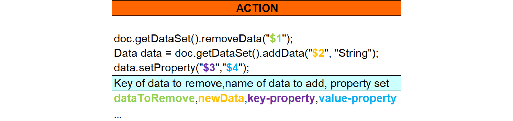
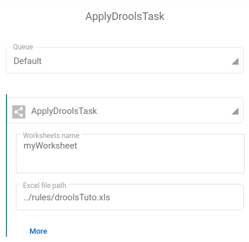

---
tags:
  - Drools
  - Java
  - Excel
---

# Drools: the Java rules engine

Based on Excel document, “drools” is a rule engine used to execute code scripts, Java code in our context. Users can define business and/or functional rules as data transformations, mapping, etc. One of the key benefits is its adaptation to any structure and any level of complexity as long as your code respects the punnet structure ([quick reminder here](../getting-started/overall-concepts#punnet) if need be 😉). It can easily be shared between your team members for complex project to have concerned people seamlessly involved. Another upside: no development skill is required to build your own rules. Fast2 supports such feature with the [ApplyDroolsTask]().

A sample of Drools spreadsheet can be downloaded to help you getting started.

[:material-file-download: Download drools template](/documents/Drools-template.xlsx){ .md-button }

## :octicons-light-bulb-16: Spreadsheet structure

The following picture represents a drool sheet as you could find one in an Excel document:


It’s composed with :

- **RuleSet**

: means that the current speadsheet is a decision table

- **Import**

: all java classes required, separated by a comma. These are the same packages that would be imported in a regular Java class in order to have the code running properly.

- **Sequential** (optional)

: specify here the order in which rules should apply

- **RuleTable** rules

: name of the table

- **NAME** column

: represents the name of the differents rules

- **CONDITION** column

: condition to verify to perform an action

- **ACTION** column

: action to perform if all previous conditions have been validated

- Variables used are indicated below the column CONDITION (doc : Document)

<br /><br />

## :octicons-light-bulb-16: How to read

Quite simple! A rule is a row read from left to right, as regular code.

An empty row is interpreted by the rules engine as the end of the process. Each rule will have to meet particular criteria. There must be at least one condition and one action per rule.

### Read a condition

- A rule can have multiple conditions
- All conditions must be validated to apply the action of the same row
- If no value is present in the condition column, the condition is skipped (considered `true`)


A condition cell will only hold one statement. If several conditions have to be met, they will be in the next columns.

### Read an action

- A rule can have multiple actions
- Actions are performed from left to right
- Inside a cell, the actions are separated by a semicolon ;



The actions are read just like any code snippet, similarly to a regular script file.

<br /><br />

## Parameters

There are two different ways to use parameters:

- You only need one parameter for your condition or action : `$param`.
- Otherwise, separate values by comma, and use `$1`, `$2` and so on in you condition/action.

<br /><br />

## :octicons-pencil-16: Write a condition

Conditions, just as in a regular coding snippet, must be performed as a boolean. Actions are executed only if condition is _TRUE_. It’s highly recommended to use `eval(<condition>)` or `!eval(<condition>)` for conditions.

!!! Check

    Just as you would write any condition in your code,

    - Conditions must not end by a semi-colon (`;`)
    - Characters allowed : `<`, `>`, `<=`, `>=`, `||`, `&&`, …

If you want to perform an action no matter what, do `eval($param)` with `$param = true`.

If you need the document to have a specific data before making any action, do:

`doc.getDataSet().hasData($param)` with `$param = yourDataName`.

<br /><br />

## Action examples

!!! Check

    You can put any Java code to perform an action, as long as you end each instruction by a semi-colon (`;`).

### Add new data

To add a new data, if you know both the key/name and the value, use the following code :

```java
doc.getDataSet().addData("<key>", "<type>","<value>");
```

In case the value is unknown at the moment or you object is too complex and you might need to add properties to the data object:

```java
Data data = doc.getDataSet().addData("<key>", "<type>");

data.setProperty("<key>","<value>");
```

When performing such operation, though, don’t forget to add the proper Fast2 package to manipulate Data type.

### Add new value to existing data

Add one value:

```java
doc.getDataSet().getData("<data-key>").addValue("$param");
```

Add multiple values to the same data:

```java
doc.getDataSet().getData("<data-key>").getValues().addAll(<list-of-values>);
```

### Stop a rule

You can stop the rule execution at a specific time when an action has been performed. Use `drools.halt();` in the action section.

The next action(s) will not be performed as the rule execution is stopped (useful in case of error management).

## :material-check-all: Good practices

We advise you to create a folder at the root of Fast2 and name it Rules. However, Fast2 will be able to fetch your drools files anywhere as long as the specified path is accessible to the Fast2 server.

This path will be fill in the the task ApplyDroolsTask.


