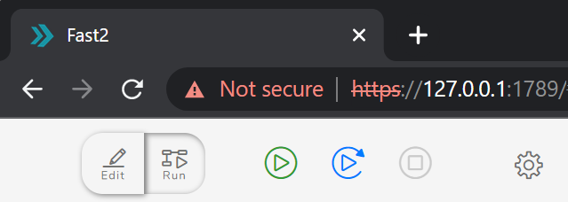

The browser-based handling of all user-related operations with Fast2 offers remote access to the Fast2 server for both designing and monitoring. Which means that, for security or privacy reasons, getting the UI of HTTPS instead of the default HTTP might be relevant in some cases.

And that is precisely what we are going to explore and implement here.

To achieve serving the Fast2 UI via the HTTPS protocol, we will use the following :

- JDK-11 (but JDK-8 works too)
- SpringBoot 2.6
- keytool
- Windows
<!-- - Google Chrome -->

Keytool is a certificate management utility provided together with the JDK, so if you have the JDK installed, you should already have keytool available. To check it, try running the command `keytool --help` from your Terminal prompt. Note that if you are on Windows, you might need to launch it from the `/bin/` folder. For more information about this utility, you can read the [official documentation](https://docs.oracle.com/javase/8/docs/technotes/tools/unix/keytool.html).

## Generate a self-signed SSL certificate

First of all, we need to generate a pair of cryptographic keys, use them to produce an SSL certificate and store it in a keystore. The [keytool documentation](https://docs.oracle.com/javase/8/docs/technotes/tools/unix/keytool.html#keytool_option_genkeypair) defines a keystore as a database of "cryptographic keys, X.509 certificate chains, and trusted certificates".

### The right tools

To achieve serving the Fast2 UI via the HTTPS protocol, we will use the following :

- JDK-11 (but JDK-8 works too)
- SpringBoot 2.6
- keytool
- Windows
<!-- - Google Chrome -->

To enable HTTPS, we'll provide our migration tool with this keystore containing the SSL certificate.

The two most common formats used for keystores are JKS, a proprietary format specific for Java, and PKCS12, an industry-standard format. JKS used to be the default choice, but since Java 9 it's PKCS12 the recommended format. Here, we are going to only dig in with the PKCS12 format.

### SSL Certificate generation

Since PKCS12 is an industry standard, let's open our Terminal prompt and write the following command to create a PKCS12 keystore, and we should, the command is the following:

```sh
keytool -genkeypair -alias fast2_ui -keyalg RSA -keysize 4096 -storetype PKCS12 -keystore fast2_ui.p12 -validity 3650 -storepass password
```

Let's have a closer look at the command we just run:

- `genkeypair`: generates a key pair;
- `alias`: the alias name for the item we are generating;
- `keyalg`: the cryptographic algorithm to generate the key pair;
- `keysize`: the size of the key;
- `storetype`: the type of keystore;
- `keystore`: the name of the keystore;
- `validity`: validity number of days;
- `storepass`: a password for the keystore.

When running the previous command, we will be asked to input some information, but we are free to skip all of it (just press Return to skip an option). When asked if the information is correct, we should type yes. Finally, we hit return to use the keystore password as key password as well.

```sh
What is your first and last name?
[Unknown]:
What is the name of your organizational unit?
[Unknown]:
What is the name of your organization?
[Unknown]:
What is the name of your City or Locality?
[Unknown]:
What is the name of your State or Province?
[Unknown]:
What is the two-letter country code for this unit?
[Unknown]:
Is CN=localhost, OU=Unknown, O=Unknown, L=Unknown, ST=Unknown, C=Unknown correct?
[no]: yes

Enter key password for <springboot>
(RETURN if same as keystore password):
```

At the end of this operation, we'll get a keystore containing a brand new SSL certificate (a true binary file) which we can check by running the following command :

```sh
keytool -list -v -keystore fast2_ui.p12
```

## Tell Fast2 to use the certificate

Now, we are just 3 steps away from having the UI relying on the certificate :

1. add the certificate file to Fast2
2. add the certificate details to the configuration of our application
3. change the broker endpoint

Add the output file `fast2_ui.p12` in the configuration folder `./config/` of Fast2, and then head out to the `./config/application.properties` file, to add the following lines :

```ini
# the port on which the server is listening.
server.ssl.key-store: config/fast2_ui.p12
# the password used to access the key store.
server.ssl.key-store-password: password
# the type of the key store (JKS or PKCS12).
server.ssl.key-store-type: pkcs12
# the alias that identifies the key in the key store.
server.ssl.key-alias: fast2_ui
# the password used to access the key in the key store.
server.ssl.key-password: password
```

!!! note

    The above step is not necessary if you managed to imported the certificate into the Java keystore of the JDK used by Fast2.

Since we intend to serve the broker and the UI via HTTPS, we need to update the `broker.url` property :

```diff
# Remote broker url to use by the worker
- broker.url=http://localhost:1789/broker
+ broker.url=https://localhost:1789/broker
```

Start Fast2 like you usually would, and head out to your web browser. Although the connection is recognized as _unsecure_, you now have access the the UI via an HTTPS connection :

{ width="50%" }

<br />
<br />

# Bring it further

When using a self-signed SSL certificate, our browser won't trust our application and will warn the user that it's not secure. And that'll be the same with any other client.

It's possible to make a client (the browser, in our case) trust our application by providing it with our certificate. However, this topic will not be addressed here.

<!-- Let's extract the certificate from the keystore with keygen:

keytool -export -keystore fast2_ui.p12 -alias fast2_ui -file fast2_ui.crt
-->
