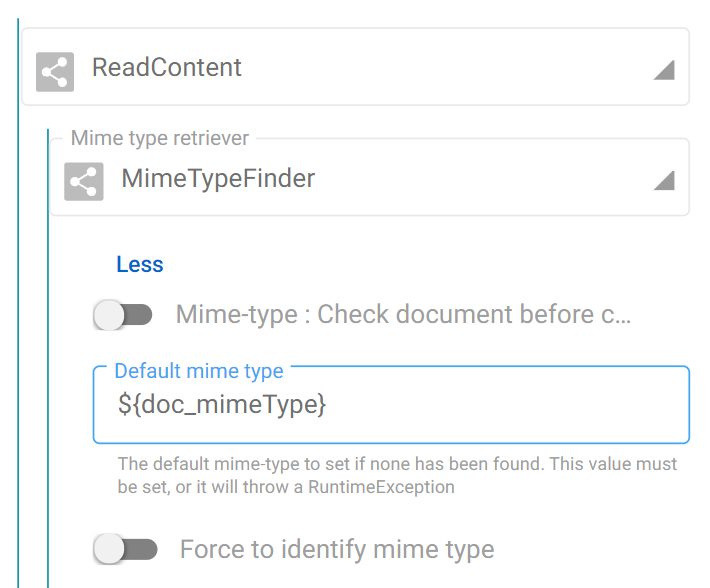
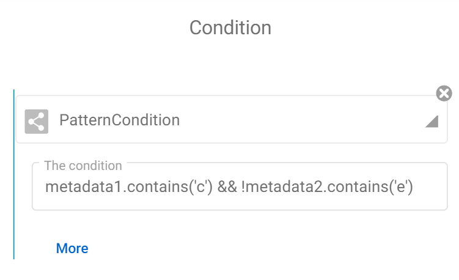

A pattern is a sequence of instructions, a model, which can be easily recognized by an aware glance. It is strictly under this definition that Fast2 patterns stand.

Our migration tool relies on a specific syntax used to dynamically retrieve information from different data-layer of the whole process, whether document, map execution or else.

!!! Tips

    For a successful pattern recognition, only use the data known by Fast2, such as :

    - Data stored in the punnet and/or documents datasets
	- Migration specific details, listed [down below](#access-data-of-fast2-objects).

## Patterns, what are they anyway ? {#context-and-definition data-toc-label="Context and definition" }

In Fast2, several data can be retrieved and accessed dynamically from a dedicated syntax which Fast2 supports for your convenience. This `${...}` syntax can be used in most of the configuration fields of the tasks composing your migration workflow.

{ width="60%" loading=lazy class="float-left"}

Using such syntax will comes in handy when you will have to rely on a value whose you only know the name. In other words, retrieving a metadata whose key is `doc_mimeType` and value is unique for every document, will just be `${doc_mimeType}`.

No need to list all your possible values, Fast2 will resolve this expression by looking first at the document dataset level, then at the punnet level, an later at map/campaign level. Some applications of the latter could be to store the name of the map, or even accessing [map- or global-scoped shared ojects]() for cross-campaign communications.

## Patterns in links

Although links are designed to offer basic statements for conditional routing, they also digest pattern for higher-complexity conditions. For example, new conditions can be value-dependent: not only you can check whether the document has a given data, but now it is possible to narrow down the eligible documents based on the value itself of this data.

!!! note

    Pattern-related syntax `${...}` is not required, fill the field with your expression directly !

Based on SpEL ([Spring Expression Language](https://docs.spring.io/spring-framework/docs/4.3.10.RELEASE/spring-framework-reference/html/expressions.html)), the syntax of these conditions will sound familiar to anyone who's already coded one day:

{ width="60%" loading=lazy class="float-right" }

In the same way, you'll now be able to sort documents based on their mime-types, on their structure (does my document has a content ? Is its creation date matching the time range which this campaign is focusing on? ).

As mentioned earlier, the list of data which you can evaluate in a condition is the same list as in a task configuration (document properties, punnet properties, map and campaign names).

### As long as it returns `true` of `false`...

More complex use-cases can be built out of the given tools, as long as the syntax matches the SpEL expression. Java-based condition are therefore supported, here are some examples to help you getting started :

- `documentId.endsWith("0")`
- `mimeType.startsWith("image/")`
- `documents.size() >= 2 || punnet.getDataSet().hasData("multiversioned")`

And the list goes on, it's your turn now to build the condition meeting your needs!

## Patterns subtleties

### Properties with colon

As handy as they may sound, patterns do embed specifications due to the particular syntax they are subjected to.

The most common issue is when dealing with colon character `:`, but the approach also addressed data name with space characters. To prevent running into a SpEL syntax error which would wipe its interest out, the syntax has to be slightly expanded. Where before you were accessing the value with `${key}`, you now need to write it as follows:

```js
${property('prefix:suffix')}

${property('with space')}
```

You can now safely extract data with namespaces, or any special character which may eventually break the SpEL syntax.

### Propose default value

In case the pattern value is not known by Fast2, an empty String is return. However, you might be willing to set a default value to ease the upcoming operations.

To do so, use the Elvis ternary operator along the `property()` function:

```js
${property('missingData')?:'defaultValue'}
```

From now on, if the 'missingData' is not fount either at the punnet or document level, the value you earlier planned to retrieve will be replaced with the value set as default, although no additional property is created.

### Access data of Fast2 objects

Whether you need [subtypes](../../getting-started/overall-concepts/#fast2-objects) properties for conditional routing or medatada elaboration, Fast2 gives you access to any data stored in the punnet.

However targetting object is not always intuitive, so here are the different keywords required to access the [Fast2 objects](../../getting-started/overall-concepts/#fast2-objects) :

| Keyword                | Description                                                                                                                             | Examples                                    |
| ---------------------- | --------------------------------------------------------------------------------------------------------------------------------------- | ------------------------------------------- |
| `${CurrentDocument}`   | Access the focused document, to call its metadata. <br/><br/>This can be quite useful when dealing with multi-document punnets.       | `${CurrentDocument.getDataSet().getData('multivalued data').getValues().get(0).split('\.')[0]}`              |
| `${CurrentContainer}`  | Access the focused content, to call its properties. <br/><br/>This can be quite useful when dealing with multi-contented documents.     | `${CurrentContainer.mimetype}`              |
| `${CurrentAnnotation}` | Access the annotation of the document.                                                                                                  | `${CurrentAnnotation.annotationId}`         |
| `${punnet}`            | Access the punnet as an object. From there, all datasets and subobjects can be accessed. The accessor is generally used for conditions. | `${punnetId.toString().startsWith('My')}`   |
| `${documents}`         | The list of the documents stored in the punnet.                                                                                         | `${documents.size()}` `${documents.get(0)}` |
| `${step}`              | The name of the step where the pattern is called.                                                                                       |
| `${map}`               | The name of the map which is run during this campaign. Often used for output directory names                                            | `${map}/my_output_file.csv`                 |
| `${campaign}`          | The name of the campaign. Often used for output directory names                                                                         | `${map}/${campaign}/my_output_file.csv`     |

### Using Java classes

Pattern can also be used to enrich data, relying on the basic Java classes.

!!! hint

    The required syntax is `T(clazz)`.

For example, adding an UUID created on-the-fly would just required using the following pattern:

```java
${T(java.util.UUID).randomUUID().toString()}
```

<br />

An other example could be to add today's date as a new data. Such a pattern might go like:

```java
${T(java.time.LocalDate).now().toString()}
```

Bringing it further, we might also want the time when the document got through the migration (namely this [AlterDocumentProperties](../../catalog/transformer/#AlterDocumentProperties) task), with

```java
${T(java.time.LocalDateTime).now().toString()}
```

Mapping these patterns respectively to a new `today` and `currentTime` data will result in the following punnet :

```json hl_lines="11-12"
{
	"punnetId": "doc_0_0#1",
	"data": {
        ...
	},
	"documents": [
		{
			"documentId": "doc_0_0",
			"data": {
				...
				"currentTime": "2023-06-14T10:42:15.204958800",
				"today": "2023-06-14"
			}
		}
	]
}
```
