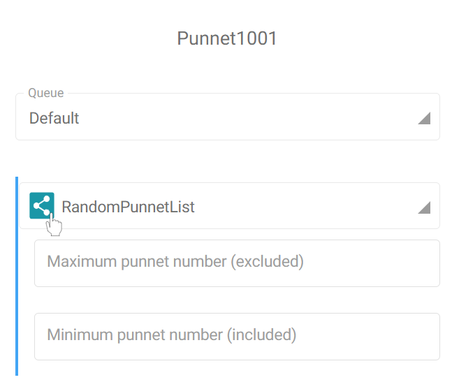
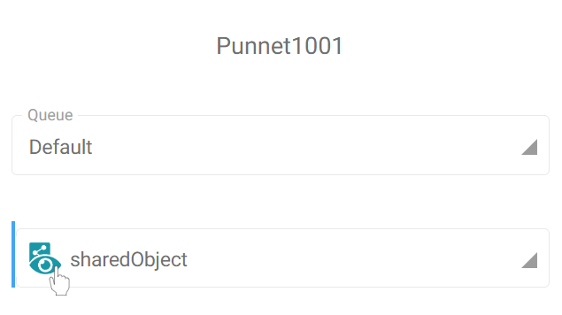
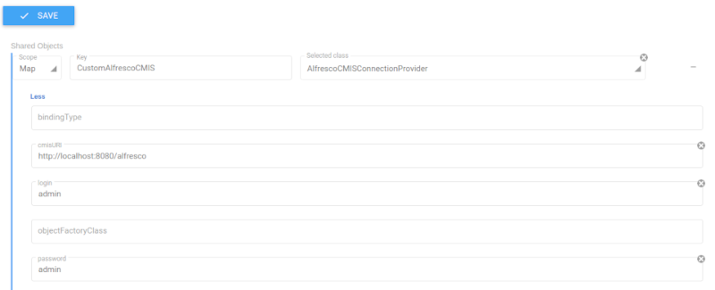
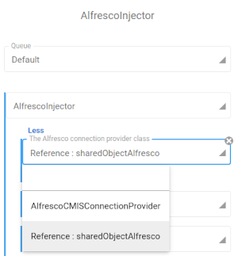

## What are they all about ?

During the design stage of a migration workflow, you may need to reuse a configuration already set for a task or Fast2 module (e.g. the connection IDs, which must be repeated for each injector or extractor or even the URL of the system to target). To avoid this repetition, Fast2 offers "Shared Objects". As their name suggests, the goal here is to create a object only once, and reuse it later on from different tasks.

The shared objects can have either scopes :

- **Map** : the object is attached to the map from where it was created (and embedded into it in case you share the map file). This object will be reachable from any task of this map, as long as the task configuration accepts such type of an object.
- **Global** : the object is shared between all the Fast2 maps. Global shared objects are stored in `{FAST2_HOME}/config/sharedObjects.xml` file. If you share a map containing global shared objects, these latter will not be embedded.

## :octicons-tools-24: Create shared objects

Shared objects are accessible from the Configuration Place (accessible via the gear icon of the top banner in both Design and Run places, tab #3 "Shared objects").

Click on the "plus" sign on the right to create a shared objects.

Each shared object is composed of three elements :

- the scope : map or global, as mentioned before,
- the key : the universal name through which the tasks will access to the object. The key must be unique per object scope,
- the module of the object (picked from a dropdown list) needed by the different tasks.

The object will be configurable like any other modules in tasks. Save once the configuration fits your needs, and your good to go !
If you have already built an object in the task configuration and want to convert it to a shared object, you can do it by clicking on the "Share" leading icon of the field.

{ width="50%" }

Choose a descriptive key name for the new shared object and validate to create the shared object. Now the configuration of the task does not hold the object anymore, it now just references it.

To visualize all the shared object available in this Fast2 instance, click on the "View shared objects" icon at the beginning of a reference.

{ width="50%" }

 

## :octicons-trash-24: Delete shared objects

To delete a shared object, use the "Minus" sign on the right of the object, from the "Shared object" tab.

## :octicons-zap-24: Complete example

Let's go through a complete scenario to see how a shared object will be used in your tasks. For the sake of this example, we want to inject into an lcoal Alfresco instance.

Step #1, let's create a shared object called **CustomAlfrescoCMIS**, as it is required to configure the Alfresco CMIS injector task. Its scope will be set to _Map_ and the selected class _AlfrescoCMISConnectionProvider_.

Once all the required fields are filled, here is what our shared object looks like.

{ width="50%" }

Step #2, browse the task catalog to add an AlfrescoInjector in your map. In the credential details, we'll find the shared object just created. It comes along with the default AlfrescoCMISConnectionProvider object.

{ width="50%" }

And you're all set. Each time you want to connect to your Alfresco, you will no longer have to create a brand new object !
