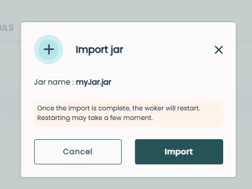

# Importing or Replacing JAR Files from the Fast2 UI (available from v2025.2.0)

## Overview

This feature allows you to import new JAR libraries or replace existing ones directly from the Fast2 user interface, without manual server intervention. The relevant workers are automatically restarted to apply the changes.

> **Note:** Due to server isolation, only embedded workers can be updated this way.

---

## User Scenarios

### 1. Uploading a Valid JAR

> You must be authenticated as **ADMIN** or **SUPER ADMIN** to upload a JAR.

1. Go to **Servers Place** → **LIBRARIES** tab

   
   

2. Click on **Import jar** (top right button)
3. Select a JAR that does not exist in `/worker-libs`
4. Either **Cancel** or **Import** the JAR

   
   

5. Workers on the same server as the broker are restarted
6. The JAR is added to `/worker-libs`
7. Worker restart and success messages are displayed

---

### 2. Replacing an Existing JAR

> You must be authenticated as **ADMIN** or **SUPER ADMIN** to replace an existing JAR.

1. Go to **Servers Place** as in step 1 above
2. Select a JAR already present (different version)
3. Workers are restarted
4. The old JAR is moved to `/worker-libs/versions` and renamed with `.old`
5. The new JAR is added to `/worker-libs`
6. Worker restart and success messages are displayed

---

## Good Things to Know

- If one or more campaigns are running, they are stopped before upload
- Attempting to upload a non-.jar file will result in an error message

> To perform any operation, ensure you are logged in with the appropriate role (**ADMIN** or **SUPER ADMIN**) and use valid JAR files. Version management and campaign protection ensure Fast2 remains stable and available during library updates.
