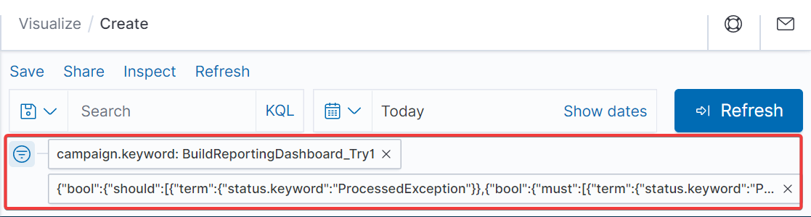
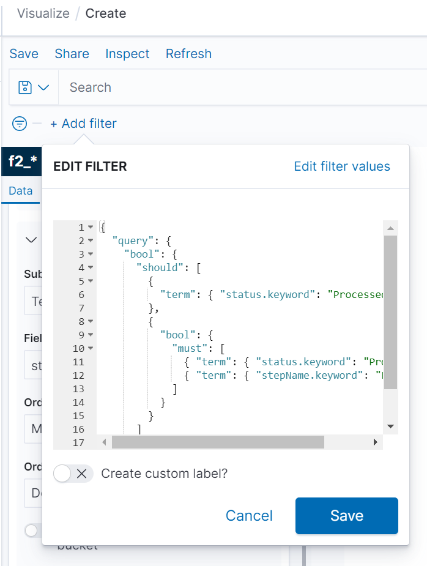

# Dashboards

Since Fast2 stores every single byte of migration information into its internal database, using dashboard capabilities for intelligible and functional reports just comes in naturally.

!!! Warning

    Prior to the v2.5, Fast2 was relying on Kibana for data vizualisation. This component has been dropped in favor of OpenSearch dashboards.

    However the configuration of these tools are very close (if not identical).

The dashboard only communicates with the database (as illustrated in the [architecture section](/getting-started/overall-concepts/#architecture).

All the chart visualizations which can be built up with this add-on and intergrated to the most advanced dashboards, solely serve one purpose: data digestion for tracking progress, by making now possible to follow edge-cases of a handful of documents lost in a week-long non-stopping flood, and building reports out of it.

## :material-chart-bar: Configure the dashboards

Fast2 does not embed any dashboard by default. However, you can get the add-on through the same portal you downloaded the Fast2 binaries. Unzip the package at the root of Fast2 installation folder.

This hierarchy will make Fast2 automatically start your dashboard.

### With or without

When Fast2 is booted up, it will by default look for the dashboard folder at the root of the installation folder. If they are unzipped in the right location, they will be started after the broker triggered the database startup.

In case no dashboard folder is found, this step will be skipped after a given number of retries (which you can find the in the `./config/application.properties` file).

The dashboards can still be disabled, even if they are available in the root folder of Fast2:

=== "v2.4-"

    ```ini title="./config/application.properties"
    broker.kibana.embedded.enabled=true
    ```

=== "v2.6+"

    ```ini title="./config/application.properties"
    broker.dashboards.embedded.enabled=true
    ```

### Ports

By default, the dashboards are serve from the port **1791**.

However they can be accessed on a different port, which you will have to highlight in 2 different places:

1.  This is required to start the add-on on another port:

    === "v2.4-"

        ```ini title="./config/application.properties"
        broker.kibana.embedded.port=8888
        ```

    === "v2.6+"

        ```ini title="./config/application.properties"
        broker.dashboards.embedded.port=8888
        ```

2.  Fast2 should know where to send the user for the visualizations:

    === "v2.4-"

        ```ini title="./kibana-X.Y.Z/config/kibana.yml"
        server.port=8888
        ```

    === "v2.6+"

        ```ini title="./opensearch-dashboards-X.Y.Z/config/opensearch_dashboards.yml"
        server.port=8888
        ```

### Remote access to the dashboards

If this port needs to be exposed and accessible from a different machine, the dashboard configuration must be configured to allow connections from remote users:

```yml title="./opensearch-dashboards-X.Y.Z/config/opensearch_dashboards.yml"
server.host: "0.0.0.0"
```

### What is the database port is changed ?

To make sure the dashboards still reach the database, make sure the port is still up-to-date in the dashboards config file :

```yml title="./opensearch-dashboards-X.Y.Z/config/opensearch_dashboards.yml"
opensearch.hosts: ["http://localhost:1790"]
```

## Advanced use

!!! Note

    If the metadata you are looking for is not available and cannot be found in the dropdown options, refresh the <code>f2\_\*</code> index (which can be manually triggered from the list of saved objects).

The dashboards add-on provided with Fast2 is the go-to tool for migration report, project advancement insights, and deeper data analysis.

However data manipulations in this tool are not always intuitive nor straight forward, although they do open new dimensions regarding in-depth studies by the compound aggregation, data conversion and other operations now at the tips of your fingers.

Several use-cases can be envisioned, we will only relate here the data conversion steps to go through given the widespread necessity of such a basic task.

### Imports objects into the dashboards feature

This section will guide you through the import process of resources (such as indices, visualization as `.ndjson` files and others).

This resource can be imported into your dashboard add-on from the right-side menu > "Stack management" > "Saved objects" > "Import"

as shown on the screen-capture below :

{ width="60%" }

### Resource #1 : Exception table

!!! Info

    This resource has been generated from OpenSearch dashboards but can be imported into either Kibana and OpenSearch dashboards.

For a list of exceptions, since the error messages and steps in error are tracked in the database but not attached to the punnet itself, it is possible to rely on the dashboards add-on to generate a table of exceptions, accross multiple campaigns. With all the punnet details required for both investigations and error resolution, but for delta migrations afterwards, this table can be exported in CSV for externalisation of this asset.

Here is an example of a table gathering :

- **Campaign**: campaign where the exception is thrown
- **PunnetId**: ID of the punnet
- **documentId**: ID of the document (useful when the punnets store several documents)
- **Document name**
- **Step** where the exception occured
- **Exception class**
- **Exception message**
- **Content** URL (if any)
- **Count** of the number of documents in the punnet

{ width="60%" }

To get started with this visualisation, or to add it to your existing dashboard, click down below :

[:material-file-download: Download this resource](/documents/dashboards_exception-data-table.ndjson){ .md-button }

This resources can be imported as [explained previously](#imports-objects-into-the-dashboards-feature).
<br/>
<br/>
<br/>

### Resource #2 : Campaign success ratio

!!! Info

    This resource has been generated from OpenSearch dashboards but can be imported into either Kibana and OpenSearch dashboards.

For a graph visualization of the success ratio per map/campaign, the following resource can be imported for a per-day granularity of the results, where exceptions are summed up (no task differenciation), for comparison with the successfully processed documents within this same campaign.

{ width="60%" }

To get started with this visualisation, or to add it to your existing dashboard, click down below :

[:material-file-download: Download this visualization](/documents/dashboards_Campaign-success-ratio-per-day.ndjson){ .md-button }

This resources can be imported as [explained previously](#imports-objects-into-the-dashboards-feature).
<br/>
<br/>
<br/>

### Resource #3 : Processing speed per task

!!! Info

    This resource has been generated from OpenSearch dashboards but can be imported into either Kibana and OpenSearch dashboards.

For a graph visualization of the success ratio per map/campaign, the following resource can be imported for a per-day granularity of the results, where exceptions are summed up (no task differenciation), for comparison with the successfully processed documents within this same campaign.

{ width="60%" }

To get started with this visualisation, or to add it to your existing dashboard, click down below :

[:material-file-download: Download this visualization](/documents/dashboards_processing_speed_per_task.ndjson){ .md-button }

This resources can be imported as [explained previously](#imports-objects-into-the-dashboards-feature).
<br/>
<br/>
<br/>

### Advanced filtering capabilities

Since the visualisations can pull out vast amounts of data from the database, most of the results might need to be narrowed down using the filter function :

{ width="60%" }

Head out to the matching documentation (Kibana or OpenSearch dashboards) for basic rules and help on how to build such filter.

We will here just focus on one main filter, which would help to only get the relevant data for either a ratio or datatable of success or failure along the migration.

Our need is to only the the documents/punnets, whose status are `ProcessedException` (to gather all failed documents, no matter the task where the exception got thrown) or the documents/punnets being both `ProcessedOK` from the injection task (which will be called here: <b>Last task</b>).

In short, we only want to select :

- the OK's of the injector, which induces the success of the migration for this document
- the KO's of all the tasks

Code-wise, since our expression would looks like this :

```js
status == KO || (status == OK && step == "Last task");
```

Since

- `||` is _should_
- `&&` is _must_

the final syntax is (for DSL -- <i>Dashboards Query Language</i> -- or KQL -- </i>Kibana query language</i>) :

```json
{
  "query": {
    "bool": {
      "should": [
        {
          "term": { "status.keyword": "ProcessedException" }
        },
        {
          "bool": {
            "must": [
              { "term": { "status.keyword": "ProcessedOK" } },
              { "term": { "stepName.keyword": "Last task" } }
            ]
          }
        }
      ]
    }
  }
}
```

This code is to be used in the filter function, as advanced filter (instead of the default fields-prepared option).

{ width="60%" }

<br />

The dashboards add-on provided with Fast2 is the go-to tool for migration report, project advancement insights, and deeper data analysis.

However data manipulations in this tool are not always intuitive nor straight forward, although they do open new dimensions regarding in-depth studies by the compound aggregation, data conversion and other operations now at the tips of your fingers.

Several use-cases can be envisioned, we will only relate here the data conversion steps to go through given the widespread necessity of such a basic task.

### Datatype conversions

Let’s consider a metadata processed by Fast2 as a String instead of a float. One frequent use-case could be reporting the sum of all content size processed during a campaign. Adding up String values never ended up well so far, Kibana will have to parse these values beforehand, to have the user access the newly created value with the correct type.

We will base our example on the following punnet structure:

```xml title="punnet.xml" hl_lines="14-16"
<?xml version='1.0' encoding='UTF-8'?>
<ns:punnet xmlns:ns="http://www.arondor.com/xml/document" punnetId="FileNetSource#page_0#pageIndex_0">
	<ns:documentset>
		<ns:document documentId="{1B62F7C4-8E75-4D99-B84C-0AAD14B13A4E}">
			<ns:contentset>
				<ns:content mimeType="application/pdf">
					<ns:url>path/to/file/content</ns:url>
				</ns:content>
			</ns:contentset>
			<ns:dataset>
				<ns:data name="MimeType" type="String">
					<ns:value>application/pdf</ns:value>
				</ns:data>
				<ns:data name="ContentSize" type="String">
					<ns:value>43315.0</ns:value>
				</ns:data>
				<ns:data name="name" type="String">
					<ns:value>file_name</ns:value>
				</ns:data>
				...
			</ns:dataset>
			<ns:folderset />
			<ns:annotationset />
		</ns:document>
	</ns:documentset>
	<folderSet />
</ns:punnet>
```

Here, the data type of the _ContentSize_ property is `String`, as the type attribute states. Our job will be to parse this `String` value to `Float`, since we have a decimal.

This operation happens in 2 steps:

1. Making the original field (with the wrong type) accessible from a script,
2. Writing the correct parsing script.

<br />

#### Step 1: Making the field accessible

Open the dashboards retrieving data from the database where Fast2 is sending the data.

Access the Dev Tools of the dashboards to execute the query, which has to be built a specific way in order to change the mapping of the field to convert.

The index prefix of Fast2 data is `f2_`, which is why the request has to specify the index to apply the `PUT` operation on.

Next you have to write in the request body the whole way to the property to convert, first by accessing the punnet, then the properties of the punnet where the documents are stored, then the properties of the documents object where the metadata are stored, and so on.

Finally specify the current type (`text` in our case), with `fielddata:true`.

The final query will look like such:

```sh
PUT f2_*/_mapping
{
  "properties": {
    "punnet": {
      "properties": {
        "documents": {
          "properties": {
            "data": {
              "properties": {
                "ContentSize": {
                  "type": "text",
                  "fielddata": true
                }
              }
            }
          }
        }
      }
    }
  }
}
```

The query is successfully executed once the `acknowledged:true` message is returned.

<br />

#### Step 2: The parsing script

Head now to the Dashboads Management section, choose ‘Index patterns’, and select the one related to Fast2 (`f2_*`).

!!! hint

    You may require to refresh the `f2_*` index, to make sure all the latest properties are fetched from the database.

Click on the "_Scripted field_" tab to create a new one using the data property you just made accessible.

Enter a relevant name (ex/ ContentSize-float), select the new type of this field (`number`, for our example), and write the following script:

```js
if (doc.containsKey("punnet.documents.data.ContentSize"))
  return Float.parseFloat(doc["punnet.documents.data.ContentSize"].value);
else return -1;
```

Save this new field, and create a new visualization displaying a sum of this data per campaign (as this was our initial challenge).

In the sum section, our field is now reachable for any chart requiring numerical data.

The `String` data is now accessible as a numerical chart field !! :partying_face:

And that’s it !

More use cases can be addressed by scripts with higher level of complexity, to create new data, digest or sort data, you name it.

This new dimension of data analysis via Kibana opens up way more possibilities, while increasing the precision of data aggregation to bring the best answers to the project management team.

<br />

## FAQ

### :octicons-question-24: Run Fast2 without dashboards

It is possible to run Fast2 without the dashboards, as this add-on is just reading data stored in the internal database, to serve them as graphical vizualisation. This

By no mean this add-on is necessary for the migration.

### :octicons-question-24: Access dashboard when not migrating

Visualizations can be reached via 2 different ways, depending on your needs:

- Either from the UI of Fast2,
- Or directly from the browser via the declared port (1791 or other).

The latter option gives access to the tool even when Fast2 is not running.

Since the dashboards fetch data directly from the database, it is not possible to populate the visualizations with migration data if the database is not running as well.

### :octicons-question-24: Dashboards do not reach the database

Make sure the database port has been correctly configured in the YAML file of the dashboards. Head to the [port section](/components/database/#port) for more details.

### :octicons-question-24: Could not ping Kibana on port 1791

Make sure declaring your port in the 2 expected places. Head to the [port section](#ports) for more details.
