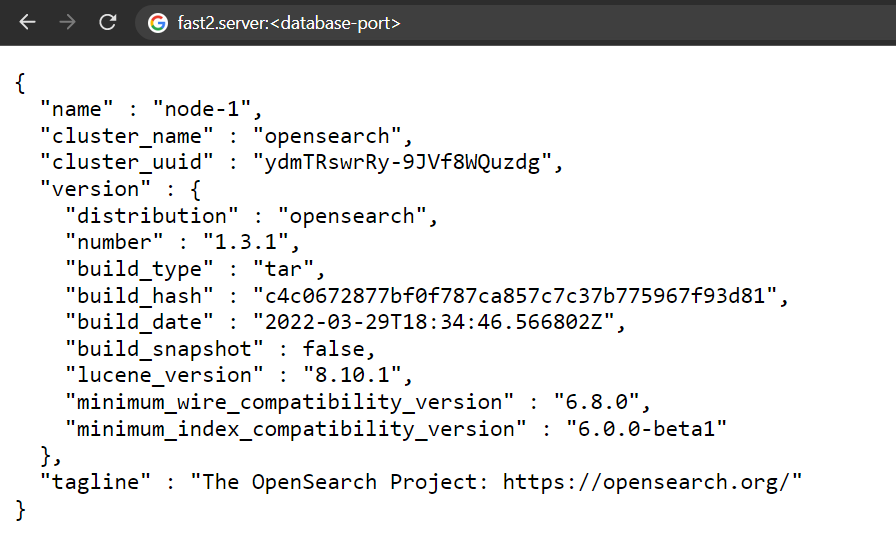

# Internal database

!!! Warning

    Prior to the v2.5, Fast2 was relying on an Elasticsearch database. This component has been dropped in favor of OpenSearch.

    However the configuration of these two databases are very close (if not identical).

Every object passing through Fast2 is stored into an internal database. Whether carried by the document or the punnet, all metadata are recorded in the warehouse. The major benefit of such architecture is the opportunity to check whether everything is going well by making counters about documents/data processed during your migrations.

In addition, we can easily rollback or resume operations in case of server crash. Nothing will be lost as Fast2 will precisely know where it all stopped.

There is the logic behind real-time backups in ES.

## :octicons-list-unordered-24: Indexes

Each Elasticsearch index referenced by Fast2 will be registered with a `f2_` prefix. An index is always written in lower case even if the campaign name in Fast2 contains characters in upper cases.

For example, the campaign `MyCampaign_Try10` will be stored in the index f2_mycampaign_try15.

During the step of broker intantiation at Fast2 startup, some indices are automatically created:

|            Index key | Description                                                        |
| -------------------: | ------------------------------------------------------------------ |
|         f2_campaigns | List of existing campaigns with processing dates and status        |
| f2_campaigns_sources | Links between campaigns and workers having performed this campaign |
|    f2_queue_settings | Reference information about source and task threads                |
|     f2_jobs_settings | Gather the configuration of save jobs                              |
|         f2_jobs_info | Information about jobs past execution details                      |

For each new campaign of Fast2, an index will be created: if you decided to run a new campaign named `EcmInjection`, the new index will be `f2_ecminjection_try1`.

## :material-database-cog: Configuration

### With or without

For an optimal migration setup, this third-party software can be easily configured at different levels to match you needs at most !
If required, it can even be disabled at will.

=== "v2.4-"

    ```ini title="./config/applications.properties"
    broker.elasticsearch.embedded.enabled=true
    ```

=== "v2.5+"

    ```ini title="./config/applications.properties"
    broker.opensearch.embedded.enabled=true
    ```

### Port

By default, Fast2 sends it data via the Elasticsearch API made available on port `1790`.

However, in the case where this port is already used by either another Fast2 instance or any other process, the port number can be changed from the configuration files.

Since Elasticsearch has to be reach from both Fast2 broker and Kibana module — if the latter is enabled. If any Elasticsearch port had to be reconfigured to match specific needs, there is exactly 3 places where to mention this change:

=== "v2.4-"

    |File|Specification|
    |---|---|
    |./config/application.properties|`opensearch.port=1790`|
    |./elasticsearch-X.Y.Z/config/elasticsearch.yml|`http.port: <es-port>`|
    |./kibana-X.Y.Z/config/kibana.yml|`elasticsearch.hosts: ["http://localhost:<es-port>"]`|

=== "v2.5+"

    |File|Specification|
    |---|---|
    |./config/application.properties|`opensearch.port=1790`|
    |./opensearch-X.Y.Z/config/opensearch.yml|`http.port: <es-port>`|
    |./opensearch-dashboards-X.Y.Z/config/opensearch_dashboards.yml|`opensearch.hosts: ["http://localhost:<es-port>"]`|

If the dashboard component is installed, the database port also needs to be updated on this front as the dashboard needs to access the DB in order to read the data :

=== "v2.4-"

    ```ini title="./kibana-X.Y.Z/config/kibana.yml"
    elasticsearch.hosts: ["http://<DB-server:DB-port>"]
    ```

=== "v2.6+"

    ```ini title="./opensearch-dashboards-X.Y.Z/config/opensearch_dashboards.yml"
    opensearch.hosts: ["http://<DB-server:DB-port>"]
    ```

<br />

### Memory

The more documents, the more data. The more data, the more Elasticsearch will need resources to digest, store, process data and respond to the broker.

Head out to the `./opensearch-X.Y.Z/config/jvm.options` file.

The configuration required are the following:

| Configuration | Purpose                                                                                   |
| ------------: | :---------------------------------------------------------------------------------------- |
|      `-Xms8g` | This setting will allocate 8GB of RAM to the Elasticsearch JVM heap, directly on startup. |
|      `-Xmx8g` | Here, you specify the maximum memory which can be used, if available, by the database.    |

!!! warning

    As specified in the `./opensearch-X.Y.Z/config/jvm.options` file, you should always set the min and max JVM heap size to **the same value**. <br /><br />See the [Official OpenSearch documentation](https://opensearch.org/docs/opensearch/install/important-settings/) for more information.

For further comprehension of these parameters, check out the [Elasticsearch official documentation](https://www.elastic.co/guide/en/elasticsearch/reference/current/important-settings.html#heap-size-settings) on the topic or [OpenSearch official documenation](https://opensearch.org/docs/1.1/opensearch/install/important-settings/).
Upgrading the metrics will prevent `java.lang.OutOfMemoryError` to pop up during heavy migration executions.

<br />

<!-- Still uptodate ??
## Database without dashboards

To visualize data stored in the database without using the dashboard addon proposed, we recommend to use web navigator plugins. These GUIs are focused on visualisation of your documents as tables, more easily than with Kibana. You can browse your data as classic SQL tables. The downside is ElasticVue does not offer any metrics, graphs or anaytics options.

Two different plugins exist, depending on your web navigator:
* [ElasticVue](https://elasticvue.com/) under Mozilla Firefox, MS Edge and Google Chrome;
* [ElasticSearch Head](https://chrome.google.com/webstore/detail/elasticsearch-head/ffmkiejjmecolpfloofpjologoblkegm) only for Google Chrome.

-->

## Remote access to the database

The next operations need to happen when the database is shut down. To make sure of that, the `jcmd` command might be of great help.

!!! Warning

        The database port needs to be opened from the Fast2 server, and accessible by your remote machine.

1.  To check the database port is accessible from your machine, run the following command (from your work station):

    ```sh
    curl <fast2.server>:<database-port>
    ```

2.  Head out to the database configuration YAML file `opensearch.yml` and add the following lines:

    ```yml
    network.host: 0.0.0.0
    node.name: node-1
    cluster.initial_master_nodes: node-1
    ```

3.  If Fast2 is installed on a Linux server, you may also need to increase the memory usage for your cluster (on the server where the database is running), as stipulated in the [Official OpenSearch documentation](https://opensearch.org/docs/1.0/opensearch/install/important-settings/).

    ```ini title="/etc/sysctl.conf"
    # for remote access to Fast2 embedded database
    vm.max_map_count=262144
    ```

4.  Save the file, and run the following command to _refresh_ your server configuration :

    ```sh
    sudo sysctl -p
    ```

5.  Restart the broker (which will induce the bootup of the database), and go check from your machine the access to the Fast2 database.

    The webpage (at the same URL we `curl`-ed in the 1st step) should display something like so :

    { width="60%" }

<br/>

<br />

## Troubleshooting

In reason of the tight commmunication between the broker and the database, chances are you will soon be reported 500 server error generated by unsuccessful exchanges of the two entities.

### Server error 500 when starting a campaign

After running quite a bunch of campaigns, you might end up not being able to start anymore of them due to the limit of shards of the Elasticsearch database (for more in-depth details about the shards, checkout the [Official Elasticsearch documentation](https://www.elastic.co/guide/en/elasticsearch/reference/current/scalability.html)).

The symptom of this limitations comes as a regular 500 server error toast in the UI, but is is by checking the logs/broker.log file that its raw nature is exposed:

```log
17:24:45.017 [http-nio-1789-exec-17] ERROR org.apache.catalina.core.ContainerBase.[Tomcat].[localhost].[/]:175 - Exception while dispatching incoming RPC call com.google.gwt.user.server.rpc.UnexpectedException: Service method 'public abstract com.fast2.model.taskflow.Campaign com.fast2.hmi.gwt.client.service.GWTCampaignManager.startProcessing(
    com.fast2.model.taskflow.Campaign,com.fast2.model.taskflow.design.TaskFlowMapRef,boolean)' threw an unexpected exception:
    java.lang.RuntimeException: Caught exception Elasticsearch exception [type=validation_exception, reason=Validation Failed: 1: this action would add [2] total shards, but this cluster currently has [1000]/[1000] maximum shards open;]
	...
Caused by: org.elasticsearch.ElasticsearchStatusException: Elasticsearch exception [type=validation_exception, reason=Validation Failed: 1: this action would add [2] total shards, but this cluster currently has [1000]/[1000] maximum shards open;]
```

As mentioned in the [Elasticsearch technicalities](#index-names), Fast2 records data under indices prefixed with `f2_`. Thus it implies to begin each index to delete with this prefix.

Although a drastic cleanu-up induced by a `curl -X DELETE -i "http://<elasticsearch-server>:<elasticsearch-port>/f2_*` would resolve our issue, you might be interested in keeping some campaigns or indices. As any _curl_ query allows, exceptions can be added to the deletion operation to prevent them from being removed of the backup database. The syntax goes as follows:

```shell
curl -X DELETE -i "http://<Fast2-server>:<database-port>/f2_*,-f2_campaigns,-f2_campaigns_sources[,-f2_<campaign-name>]"
```

<br/>
<br/>
Let us now study this query:
<br/>
<br/>

| Section                               | Purpose                                                                                                                                                                                                                                             |
| ------------------------------------- | --------------------------------------------------------------------------------------------------------------------------------------------------------------------------------------------------------------------------------------------------- |
| http://server:port/f2\_\*             | Here we ask to aim at all indices starting with the `f2_` prefix. This will prevent the deletion of additional indices which could be related to parallel work on the same Elasticsearch instance, such as Kibana reports, charts or data analysis. |
| `-f2_campaigns,-f2_campaigns_sources` | These 2 indices are needed if you decide to keep any other campaign. The `-` sign declares them as exception from the delete action.                                                                                                                |
| `[,-f2_<campaign-name>]`              | Then you can list all the campaigns you are willing to preserve, <ul><li>without space,</li><li>separated by commas (`,`)</li><li>mentioning the `-` exclusion character</li></ul>Do not forget to begin each name with the indice prefix.          |

<br/>

Wildcards are supported, therefore an exception written `-f2_mycampaign*` will protect all the campaign with this _myCampaign_ radical (ex/ myCampaign_Try1, myCampaign_Try2...).

### Impossible to get results from Explorer place

Documents concerned by a migration can quickly add up, especially on cumulative campaigns. When heading to the Explorer to check punnets results, you may end up with too much information to retrieve from the database. An "error 500" message will then pop up, and if yu head out to the broker.log, the following stack will be found:

```log
Suppressed: org.elasticsearch.client.ResponseException: method [POST], host [http://localhost:1790], URI [/f2_campaign_try1/_search?pre_filter_shard_size=...], status line [HTTP/1.1 503 Service Unavailable]
{"error":{"root_cause":[{"type":"too_many_buckets_exception","reason":"Trying to create too many buckets. Must be less than or equal to: [10000] but was [10001]. This limit can be set by changing the [search.max_buckets] cluster level setting.","max_buckets":10000}],"type":"search_phase_execution_exception","reason":"all shards failed","phase":"query","grouped":true,"failed_shards":[{"shard":0,"index":"f2_stg-100k_try1","node":"4XM6VD2wTfeOSpr2brIs7g","reason":{"type":"too_many_buckets_exception","reason":"Trying to create too many buckets. Must be less than or equal to: [10000] but was [10001]. This limit can be set by changing the [search.max_buckets] cluster level setting.","max_buckets":10000}}]},"status":503}
```

To fix this, you need to stop Fast2 (and the database), and add the following line:

```yml title="./elasticsearch-X.Y.Z/config/elasticsearch.yml"
search.max_buckets: 1000000
```

## Let's quickly wrap up, here

This integrated database guarantees data persistence to Fast2. If required, an Elasticsearch database can be shared among several Fast2 servers.

<br/>
Allocated resources should be increased in order to resist charge of production environments.
