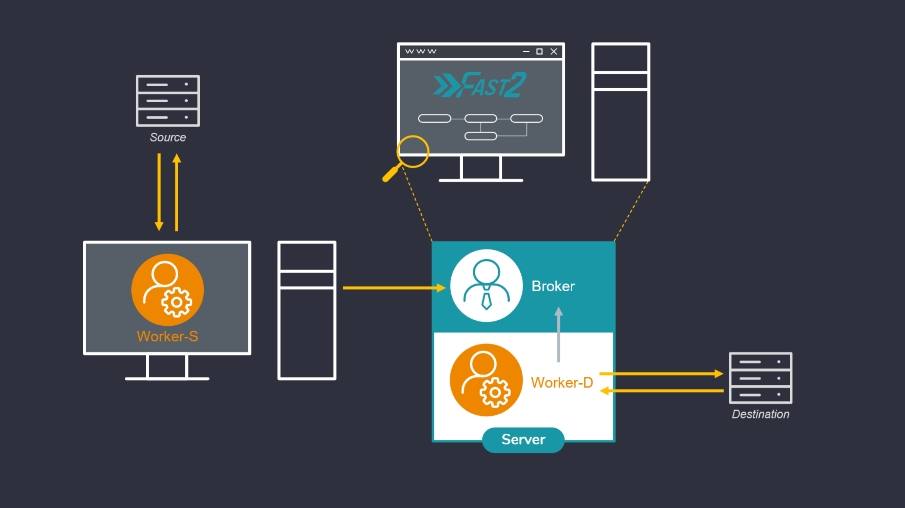

# The worker

!!! Hint

    The Worker is the punnet processor, applying the changes onto the punnet, according to how the tasks have been configured by the user.

The workers! Corner stones of Fast2, these guys can litterally add up and constitute a real digitized hive working to migrate your documents,
your contents, your rules, your metadata, all synchronously, exactly where you expect them (or asked them to be), never stepping on each other.
No migration project could be overcome if it was not by them!

If their role can seem quite important, they are paradoxically as easy and straight forward to get up and running. Just the right files to gather, as mentioned here, and a new worker just enrolled!

One of the major aspects of a promising migration project is what all project managers will ask you to vouch for: performance metrics. Let’s suppose you need to migrate documents from a source system into a second one, the latter having a much higher input flow tolerance. No need for empirical statistics to know that the old ECM will be the bottleneck. An architecture similar to a hybrid deployment variant (topic we presented [here](https://www.fast2.tech/blog/deployment-variants/)) could easily be envisioned. But let’s complicate things a little bit here: in-between the extraction and the injection phase, the metadata have to be updated, with new date formatting and heavy mapping of document related properties. Can still a hybrid-like architecture save you now ?

## :material-hard-hat: Configure the worker(s)

The required files for the worker to run properly are the following:

| Item                                                     | Purpose                                             |
| -------------------------------------------------------- | --------------------------------------------------- |
| :material-folder: config/\*                              | Configuration files, broker endpoint etc            |
| :material-folder: worker-libs/\*                         | All libraries and dependencies for tasks executions |
| :fontawesome-brands-java: fast2-worker-package-X.Y.Z.jar | Worker main unit                                    |
| :material-microsoft-windows: startup-worker.bat          | Binary file for Windows                             |
| :fontawesome-brands-linux: startup-worker.sh             | Binary file for Linux                               |

### Change JDK

If you want to use a different jdk version than the one referenced in JAVA_HOME environment variable, you can update the `JAVA_HOME` value in `./config/env.properties`:

```ini title="./config/env.properties"
...
# Override JAVA_HOME environment variable
JAVA_HOME=/usr/lib/jvm/java-8-openjdk-amd64
```

### Memory allocation

Depending on the amount of documents and the number of tasks you are dealing with, you may want to control max memory usage allowed (`Xmx`) for worker.

The default setting is 1GB for this resource:

```ini title="./config/env.properties"
...
# Worker Maximum memory allowed (Xmx)
WORKER_MAX_MEMORY=1G
```

Keep in mind that this property is designed for workers started from the binary `start-worker.sh|.bat`. If you intend to target the embedded worker, go to `./config/application.properties` instead:

```ini
...
# Broker embedded worker max memory
broker.embeddedworker.max.memory=1G
```

### Queues management

Queues have to be declared to the workers for them to process the punnets stored in these sames _queues_.

The queues names will also be declared in the tasks configuration panel, so the only worker in charge of executing a task with a defined queue will be the worker whose queue regex matched this very queue.

In order to have specific worker tied to particular queues, the configuration needs to be updated here:

```ini title="./config/application.properties" hl_lines="2"
# Worker queue regex filter
# worker.queue.regex=.*
```

### Disabled the embedded worker

In case serveral workers are required for specific queues and tasks, there might be no more need of the embedded worker itself. To make sure not to have it running pointlessly, this worker can be disactivated from the `./config/application.properties` files, as so :

```ini title="./config/application.properties" hl_lines="2"
# Disable auto-launch of embedded worker
broker.embedded.worker.autostart=false
```

## :octicons-zap-24: Advanced use

One of the major aspects of a promising migration project is what all project managers will ask you to vouch for: performance metrics.
Let’s suppose you need to migrate documents from a source system into a second one, the latter having a much higher input flow tolerance. No need for empirical statistics to know that the old ECM will be the bottleneck. An architecture similar to a hybrid deployment variant (topic we presented [here](https://www.fast2.tech/blog/deployment-variants/)) could easily be envisioned. But let’s complicate things a little bit here: in-between the extraction and the injection phase, the metadata have to be updated, with new date formatting and heavy mapping of document related properties. Can still a hybrid-like architecture save you now ?

### Several workers

### Context

One of the major aspects of a promising migration project is what all project managers will ask you to vouch for: performance metrics.
Let’s suppose you need to migrate documents from a source system into a second one, the latter having a much higher input flow tolerance. No need for empirical statistics to know that the old ECM will be the bottleneck. An architecture similar to a hybrid deployment variant (topic we presented [here](https://www.fast2.tech/blog/deployment-variants/)) could easily be envisioned.
But let’s complicate things a little bit here: in-between the extraction and the injection phase, the metadata have to be updated, with new date formatting and heavy mapping of document related properties. Can still a hybrid-like architecture save you now ?

### How to set up

Checkout in the official documentation the required Fast2 files and folders to set up a new worker. Leave a copy of the required files and folders on the machine hosting the source environment. This worker -- let’s label it as worker-S for “source” -- will be assigned to the extraction part.
As indicated in the installation section, starting Fast2 will launch an embedded worker, assigned by default to all tasks composing the migration workflow. This worker here will be our worker-D (for “Destination”, or “Default”).

Plug the worker-S onto the Fast2 broker (yes, the workers -- as [illustrated here](../getting-started/overall-concepts.md#architecture) -- manifest themselves to the broker, and not the other way around) : to do so, open the `config/application.properties` of the worker-S :

=== "v2.4-"

    ```ini title="./config/application.properties"  hl_lines="4"
    # Fast2 2.1.0 configuration

    # Remote broker host to use by the worker
    broker.host=localhost

    # Remote broker port to use by the worker
    # broker.port=1789
    ...
    ```

=== "v2.5+"

    ```ini title="./config/application.properties"  hl_lines="4"
    # Fast2 2.8.0 configuration

    # Remote broker url to use by the worker
    broker.url=http://localhost:1789/broker

    # Port exposed by Broker
    server.port=1789
    # Context path used by Broker
    server.servlet.context-path=/

    ...
    ```

Update the name (or IP address) of the machine where Fast2 is running (`broker.host`), and the name of the queue which the worker will be assigned to (ex/ “extraction”).

1. Start now the Fast2 server ([documentation here](../getting-started/installation.md#start-fast2-broker)) to have it up and running alongside the worker-D. This latter will be assigned to both the _mapping_ of the metadata and the injection of the documents in the destination environment.
2. Then start the worker-S ([documentation here](../getting-started/installation.md#start-fast2-worker)).

{ width="80%" }

Open your browser to reach the Fast2 UI, and then build up your migration workflow. For the sake of this example, 3 tasks only will suit our needs of extraction, metadata transformation and load.

> 3 tasks, 3 queues, 2 workers: lock and load !!

The extraction task will be linked to the same queue we mentioned in the `config/application.properties` of the lone worker (ex/ source-queue).

No need to set a queue for the last task, as it will be handled by default by the last worker started with the Fast2 server.


For this worker, the `config/application.properties` will have the queue details set as follows:

```ini
...
# Worker queue regex filter
worker.queue.regex=source-queue
```


For this worker, the `config/application.properties` will have the queue details set as follows:

```ini
...
# Worker queue regex filter
worker.queue.regex=metadata-queue,default
```

### Limits

Just like any architectural decisions, such model comes with its drawbacks and benefits. If the benefits can sound quite obvious given past explanations, the downsides are worth mentioning. We will shortly discuss here about the two most current:

- Resource sharing: the more workers you’ll start on the same machine, the less they’ll have individually available resources.
- Connections and sessions: duplication of workers induces duplications of server calls, therefore opened sessions.

#### Resource sharing

Let’s consider a migration server with 8GB of RAM (which is a pretty good start, don’t get me wrong):
with a running database in the background — the embedded Elasticsearch instance which Fast2 relies on in terms of traceability — needing roughly 3GB, the operating system using 3GB as well, you’ll end up with only 2GB for your worker to open around 100 documents per second and performing content conversion, metadata transformation etc. Needless to say, adding a second worker won’t help you much here !

Increase the threads amount (which you can do in the server configuration, straight from the Fast2 UI) of the queues on which you worker will get the punnets to process will surely be the go-to way for increasing your current performances.

The most recommended scale-up here would be to start another worker on a different machine, using totally independent physical resources and combining them to the ones already solicited by the Fast2 server.

#### Connections and sessions maxout

A second non-negligible aspect is the number of connections and sessions opened by the workers to communicate with both the source and destination environments. Adding worker will consequently increase these numbers, especially if several threads have been allocated to their processing queues.

<br />
<br />

### And what about...

#### Several workers on the same machine?

One easy application of multi-worker architecture could be the need of having several source system to extract documents from, via dedicated maps for each. Booting up several workers associated with the right task queues will provide sufficent segmentation to have your migration happen simultaneously.

Sessions conflicts can be prevented as well but such choices of architecture. At the end of the day, only one Fast2 server will have been managing all your different workflows, all you data will be stored in the very same Elasticsearch database, all with significantly better performance rates!

#### Several workers on the same queue?

In case of seeking for more physical resources for your Fast2 server which, let’s say, is not a scalable machine, you could envision to “plug” a second server to the first one: start another worker on the second machine, and have it aim to the initial Fast2 server where the broker is running. This separate worker will be able to process any task of your workflow, any queue as well, just like the embedded one.

However there would be absolutely no point in starting another worker assigned to the same queues as the embedded one on the Fast2 server. That won’t positively affect you performance rates. If that was you goal before scrolling this page, the secret relies in adding more threads to your queues (as mentioned earlier)!

### Remote worker: Configuration Guide

This guide explains how to configure a remote worker to your broker. It covers both scenarios: when both applications are on the same network and when they are on different networks.


#### Prerequisites

- Java Development Environment: Both the worker and broker applications should have at least a jdk8+ available on their environment. We highly recommend a jdk11.
- Network Connectivity: Both systems should be able to connect to each other through the network (whether local or remote).


#### Remote worker config

```properties 
server.host=<broker_ip_address>

# Remote = docs ends broker side
# Local = docs ends worker side
worker.content.factory=<remote|local>
```

#### Network

##### Same Network Scenario

- Local IP Address: The worker and broker should be able to communicate over their local network using their local IP addresses.
- Network Configuration: The local network should not have strict firewall rules that block communication on the required ports.

##### Different Networks Scenario

- Public IP Address of Broker: The broker should have a public IP address, or at least a static public IP from the router.
- Port Forwarding on Router: The router connected to the broker must have port forwarding configured to forward incoming traffic on specific ports to the broker’s local IP address.
- Firewall Configuration: The firewall on both systems (worker and broker) should allow incoming and outgoing traffic on the required ports.
- Dynamic DNS (Optional): If the public IP address of the broker is dynamic, you may want to use Dynamic DNS (DDNS) to avoid manually changing the address every time it changes.

#### Configure Worker and Broker on same network

**Step 1: Ensure Network Connectivity**
On the worker machine, ensure that you can ping the public IP address of the broker. You may need to test it by pinging broker_public_ip_address.
```bash
ping <broker_public_ip_address>
```
If the ping works, proceed to the next step. If the ping does not work, there may be an issue with the router, firewall, or routing configuration.

**Step 2: Update the broker.url in the Worker Configuration**
On the worker machine, update the **server.host** property in your *config/application.properties* file to the local IP address of the broker.

If needed, you can change the protocol and port information as well. The **broker.url** variable is automatically updated. Do not change it.

```properties
server.protocol=http
server.host=<broker_local_ip_address>
server.port=1789

broker.url=${server.protocol}://${server.host}:${server.port}/broker
```
Make sure the port is open and the broker is listening on the specified port.

**Step 3: Verify broker is listening on specified port**
On the broker machine, verify that the broker application is listening on the port you specified by using the following command:
```bash
# Linux
sudo netstat -tuln | grep <port>

# Windows
`netstat -ano | findstr <port>`
```
The output should show something like:
```ruby
tcp6       0      0 :::<port>                 :::*                    LISTEN
```

**Step 4: Test the connection**
On the worker machine, test the connection to the broker using nc (netcat) to check if the port is open and accessible:
```bash
# Linux
nc -zv <broker_local_ip_address> <port>

# Windows
telnet <broker_local_ip_address> <port>
```
If the connection is successful, the worker and broker can communicate.


#### Configure Worker and Broker on different networks

**Step 1: Configure Port Forwarding on the Broker’s Router**
On the router connected to the broker, you need to configure port forwarding to forward incoming traffic on a specific port to the broker's local IP address and port.

1. Log into the router's web interface (usually at 192.168.1.1 or 192.168.0.1).
2. Navigate to the Port Forwarding or NAT settings section.
3. Add a rule to forward traffic coming on port to the internal IP address of the broker (broker_local_ip_address).
4. Save the settings.

**Step 2: Verify Firewall Configuration**
Ensure that both the broker’s firewall and the worker’s firewall allow communication on the specified port. If necessary, open the required port in the firewall:

On Ubuntu, to open a port in the firewall (if using ufw):

```bash
sudo ufw allow <port>/tcp
```

**Step 3: Repeat steps explained for same network**

#### Remote worker configuration
You have multiple options through the application.properties file to configure your remote worker.

##### File storage : broker or worker ?

You can either store the files processed from the broker or at the worker side.
To choose one or the other you simply have to modify this property :

```properties
worker.content.factory=<remote|local>
```

- Select **remote** to send back documents to the broker.
- Select **local** (default value) to keep documents processed by the worker from its side

##### Example
This is an example to understand what happens for both scenarios. Imagine that we are extracting some documents from a Documentum environment and we need to convert tiff files to a pdf format.

###### Local


###### Remote


##### File storage architecture

By default, documents processed by the worker will be stored under the folder **files/**.
Then documents will follow a strict hierarchy as mentioned in the property **worker.files.pattern**

```properties
worker.files.dir=files/
worker.files.pattern=@{campaign?:'shared'}/@{step?:'shared'}/@{documentId?:punnetId}
```
Values shown above are used by default. Feel free to change it to match your requirements in term of folder organization.


#### Troubleshooting
##### Common Issues

###### Ping does not work
Ensure that the devices can actually communicate over the network. Double-check the network cables, Wi-Fi connection, and make sure there are no misconfigured network settings or firewalls blocking ICMP packets.

###### Connection times out
If using public IP addresses, check the router’s port forwarding configuration and verify that the firewall on both the broker and worker machines allows traffic on the relevant port.

###### Port is closed
Verify that the broker application is actually listening on the specified port, and ensure the port is not blocked by a firewall.

###### Public IP changes
If the public IP of the broker changes frequently, consider using a Dynamic DNS (DDNS) service to map a domain name to the changing IP address, so the worker can use the domain name instead of an IP address.