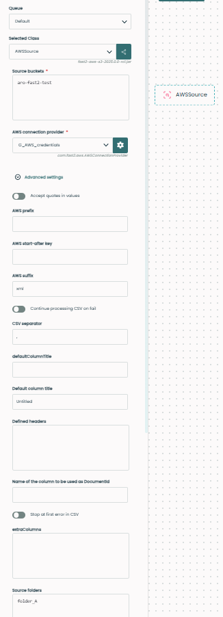
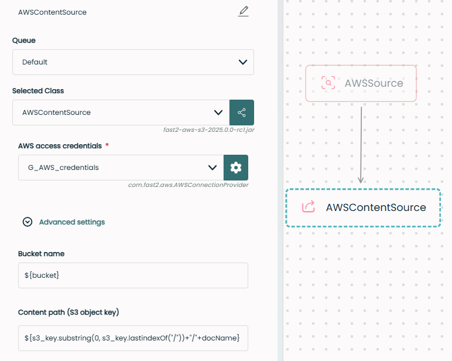

Extracting metadata from a S3 bucket needs to be done differently than what could be done with a regular content management system, because it is a storage space and not an ECM.

!!! warning "Prior to v2.10, Fast2 needed a few steps to add “manually” (with [AlterDocumentProperties](../catalog/transformer.md#AlterDocumentProperties)) key and bucket information in the XML file, to then get corresponding PDF files."

Extracting metadata from a S3 bucket needs to be done differently than what could be done with a regular content management system, where a document is a set of contents and metadata. Indeed, S3 bucket is a storage space and not an ECM (we’ll get into that a little bit later).

Let’s quickly review here how extracting both content and metadata in a S3 bucket can be achieved with Fast2.

## 🧐 Where do we come from ?

For this case, let's supposed our documents have been injected in S3 bucket (direct sequel of the Upload content and metadata in a S3 bucket cookbook). This action splits them into pairs of individual files : contents (PDF) and matching metadata (XML) files, each sharing the same file name.

<figure markdown>
```txt
├─ Bucket S3/
│       ├─ folder A
│       │     ├─ document_A_1.xml
│       │     ├─ document_A_1.pdf
│       │     └─ ...
│       │
│       ├─ folder B
│       │     ├─ document_B_1.xml
│       │     ├─ document_B_1.pdf
│       │     └─ ...
│       └─...
└─ ...  
```
</figure>
Another constraint is that the PDF path information has been set into the XML file during the serialisation prior to the injection. So, once stored in the S3 bucket, it is not up-to-date.

## 🤔 Where to go ?

We want to end up with a regular Fast2 document composed with a content (PDF) and its metadata (parsed from the matching XML). Because of the old content path information (explained earlier), the content (PDF) will not be found in the XML information, inducing an incomplete document to be created.

## 🚀 Way to go !

First, we identify XML files. They contain all metadata, namely the PDF content we need to attach.

Then, we update the file extension : PDF and corresponding XML files have the same name.

And finally, thanks to the source information, and XML metadata, we resolve the matching PDF content path, extract it from the bucket, and tie it to the Fast2 document.

### 🔎 Find content from metadata

In the [AWSSource](../catalog/source.md#AWSSource) task , we extract only interested XML files because they contain metadata :

To only select punnet-formated XML correponding to the punnets, you will need to fill the AWS suffix field with : `xml`.

Optionally, you can also provide the concerned folder(s) in the Source folders if relevant.



In the [AWSContentSource](../catalog/contentsource.md#AWSContentSource) task configuration, fields to fill are :

- Bucket name : `${bucket}`
- Content path (S3 object key) :

```java
${s3_key.substring(0, s3_key.lastIndexOf(“/”)) + ”/” + docName}
```

By filling the S3 objecy key, the connector will on-the-fly build up the correct path where to look for the related content, and tie it to the punnet.

Fast2 extracts all metadata files present in our S3 bucket, following the key of the XML, as a punnet, and names them correctly.



## 👏 Let's wrap up

We updated path information into XML files, which contain the XML-structured punnet. Then, we can attached corresponding PDF files.

We have now punnets containing linked content and metadata, which were sharing the same name in the bucket.

Next, we could process them through additional conversion or data transformation steps, or inject them into a secondary repository, you name it.
