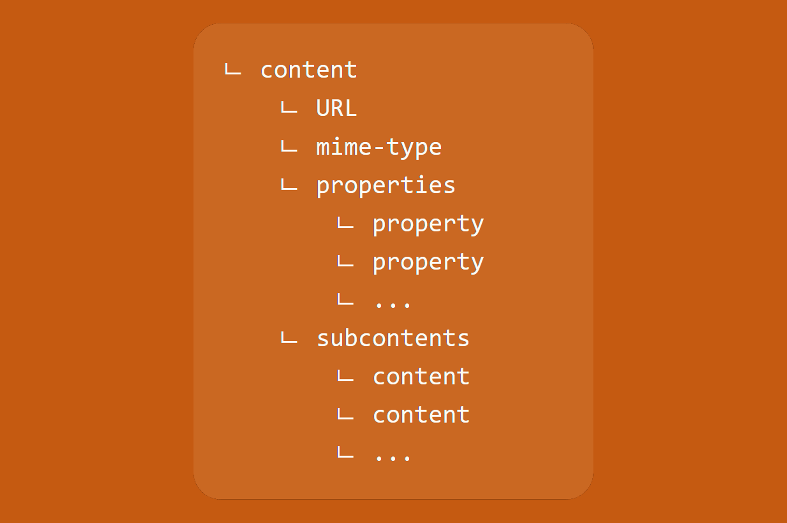

# Learn how to deal with contents



In Fast2, contents are objects embedding the "file" (= binary format) of the document. They can be found within either documents themselves or annotations, and can be accessed through different ways. Contents usually hold a mime-type property, alongside any other property closely related to the content itself.

Contents are often referred as **ContentContainers**.

## How to create a content

This section relates of how to add a content from the code.

If you wish to add a content (or delete it), head out to the [AlterDocumentContent](../catalog/transformer.md#AlterDocumentContent) task.

```java

// From an URL or a path
ContentContainer myContent = task.getManager()
                    .getPunnetContentFactory()
                    .createContent(myDocument, myUrl);


// From an inputstream
ContentContainer myContent = task.getManager()
                    .getPunnetContentFactory()
                    .createContent(myPunnet, myDocument, myInputStream);


// From a byte array
ContentContainer myContent = task.getManager()
                    .getPunnetContentFactory()
                    .createContent(myPunnet, myDocument, myByteArray);

```

## How to access a content

When digging into the structure of a punnet from the Explore place, you'll come across an URL pointing to the location of the binary file.

However there is quite a few ways of accessing a given content:

```java

// As java file
File myFile = task.getManager()
                    .getPunnetContentFactory()
                    .getContentAsFile(myContent);


// As byte array
byte[] myBytes = task.getManager()
                    .getPunnetContentFactory()
                    .getContentAsByteArray(myContent);


// As URL
URL myURL = task.getManager()
                    .getPunnetContentFactory()
                    .getContentAsUrl(myContent);


// As RandomAccessInterface
RandomAccessInterface myRAI = task.getManager()
                    .getPunnetContentFactory()
                    .getContentAsRandomAccessInterface(myContent);

```

## Mime-type

The content mime-type is a property usually added by the [MimeTypeFinder](../catalog/tool.md#MimeTypeFinder) task. However you could be willing to force it, which can be done like so:

```java
myContent.setMimeType("the right mime-type");
```

This is basically what the [MimeTypeFinder](../catalog/tool.md#MimeTypeFinder) will do once the mime-type resolved from the content format.

To access this value, a regular java getter will do:

```java
String myMimetype = myContent.getMimeType();
```

## Properties

The contents in Fast2 also embed properties, for more closely related data.

```java

Collection<Property> myProps = myContent.getProperties();

String myValue = myContent.getProperty(myName);

myContent.setProperty(myName,myValue);

```

## Sub-contents

Subcontents are just regular contents stored into a **ContentSet** attached to a content.

They can be both created/added and removed:

```java
ContentSet subContents = myContent.getSubContents();

myContent.clearSubContents();
```
