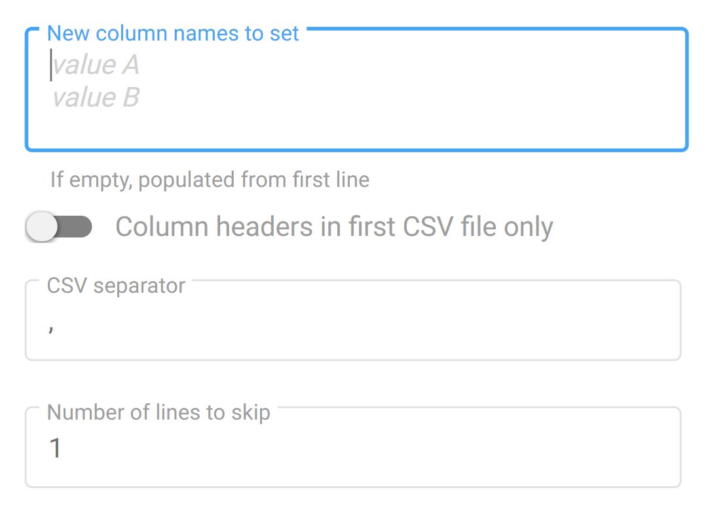

Ever wondered how Fast2 could help you dive into archives and come out with burried content and metadata? It actually is quite simple, as long as you have the right tools in your hands.

The CSVSource task has been designed to receive a CSV file as input.

## Basic usage
With little to no configuration, each line represents one document with different values matching the column header. From a Fast2 standpoint, a CSV with following content :
<figure markdown>
```txt
header1,header2
value1_A,value2_A
value1_B,value2_B
```
</figure>

will generate 2 documents :

 - The first document will have 2 data, `header1: value1_A` and `header2: value2_A` 
 - The second document will have 2 data, `header1: value1_B` and `header2: value2_B`<br/>

Although the default before resolved the data names from the 1st row (column headers), these names can be overwritten by the user, or even enriched.

## Change data names
As for the first option (overwriting data names), the configuration needs to focus on the "New column names to set".

Enter each new header on a new line, making sure your input covers all the columns found in the CSV file.

{ width="70%" }

With such a setting, Fast2 will map the data retrieved from the CSV directly under those new data names.

### Example
Let's consider processing a CSV file with the following content:
<figure markdown>
```txt
header1,header2
value1 ,value2
```
</figure>

With the default settings, the document in Fast2 would have such dataset:

<figure markdown>
```json
{
    "header1": "value1",
    "header2": "value2"
}
```
</figure>


If the CSVSource task is configured as shown below,


{ width="70%",align=center }


the created document will only have a dataset looking like:

<figure markdown>
```json
{
    "new header A": "value1",
    "new header B": "value2"
}
``` 
</figure>

Fast2 will keep no trace of the old header names, generating a document with a dataset populated from the CSV file alongside new data names.

Of course this data name mapping could have been handled by an additional task, such as [Drools](../catalog/transformer.md#ApplyDroolsTask) or [JSTransform](../catalog/transformer.md#JSTransform) (just to name a few).

But this CSV task here combines these 2 steps (of parsing and mapping) into a single one, lowering room for error and freeing the document of unnecessary information you'd not even have used.

## Create extra columns based on existing data
This feature requires the configuration of the `extracolumns` option.

Syntaxe
Enter one line per new data you intend to create.

### Syntax goes as follows :

```js
[variable]=[function]:[param1]:[param2]:[param3]:[param4]...
```
### Rules
1. The separator is the character `:` (semi-colon).
2. Parameters have to striclty match the format `$<data_name>`. A data with the name "key" will be accessed under `$key`.
3. Parameters can use other params

<figure markdown>
```ruby
param1=stringLength:$keyA
param2=substring:$param1:3:5
```
</figure>

### Supported functions
|Function|	Description|
| - | - |
|stringLength|	length of param1|
|substring	|substring of param1, from param2, during param3 characters|
|concat	|concatenation of all params|
|ifeq	|if param1 equals param2, then takes value of param3, otherwise param4|

### Example
We consider the following CSV content as input :
<figure markdown>
```txt
header1,header2,header3,header4
value1 ,value2 ,value3 ,this-is-the-value4
```
</figure>

In the following examples, a new data with the name 'var_name' will be created with the value depending on the chosen option.

|How to write it	|Value of the 'var_name' data|
| - | - |
|`var_name=stringLength:$header1`|	Length (as integer) of the data 'value1' under 'header1', so **6**.|
|`var_name=substring:$header1:0:4`|	First 4 characters of the value under key `header1`, so **valu**.|
|`var_name=substring:$header4:4:7`|	The 7 consecutive characters starting from the 5th one (counting from 0). So **is-the-**.|
|`var_name=concat:OK/:$header1:/:$header2:_:$header3:.pdf`|	Output : **ok/value1/value2_value3.pdf**|
|`var_name=concat:KO/:$header1:.pdf`|	Output : **KO/value1.pdf**|
|`var_name=ifeq:$header1:18:$header2:$header3`|	Value of 'header1' is not equal to '18', so the output is **value3**.
