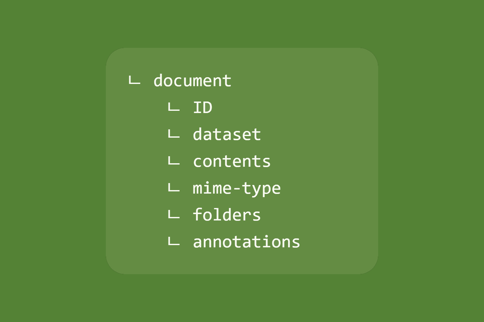

# Learn how to deal with documents



The documents are a main part of any migration, if not the purpose of it. Here are the basics for an appropriate understanding of the Java API of the document object.

For a better understanding of the following, the document structure needs to be clearly visualized. If required, go back to [the definition](../getting-started/overall-concepts.md#document) of such an object in Fast2.

## Creation

As explained in the [basics of punnet](punnet_basics.md) a document can be created on the fly:

```java
Document myDoc = myPunnet.addDocument(DocumentId.id());
```

If required, the document ID can be force by adding a parameter into the document ID creation:

```java
Document myDoc = myPunnet.addDocument(DocumentId.id("myDocId"));
```

However the ID can be forced after the document creation:

```java
myDoc.setDocumentId(DocumentId.id("myDocId"));
```

Later on, its ID can be retrieved just like the punnet's:

```java
DocumentId myId = myDoc.getDocumentId();
```

## DataSet

The purpose of the document dataset is to store metadata closely related to its entity.
When data are not too tighly related to the content of a document, chances are they will be stored as this dataset level. The [mime-type](#mime-type) does not follow this rule, though.

This dataset can be access via an usual getter:

```java
DataSet myDataset = myDoc.getDataSet();
```

A document is built with an empty dataset by default.

For more information concerning the dataset, head out to the [dedicated section](dataset_basics.md).

## Contents

In Fast2, a document can have no to several contents.

No-content cases could be like:

- the document does not have a content, originally
- the content has already been migrated
- the migration is just an update with only a few metadata to send to the destination

<br />

Several-contents cases could be like:

- the document has attachments (1 content per attachment)
- the document has content of different types (e.g. a PDF file alongside a TIFF file)

However the ratio 1-content-for-1-document is quite common.

Contents are accessed via the `ContentSet` which basically is a collection of `ContentContainer`s:

```java
ContentSet myContents = myDoc.getContentSet();
```

A document is built with an empty contentset by default.

For more information concerning the contentset, head out to the [dedicated section](content_basics.md).

## Mime-type

All documents provide a shortcut to their first content mime-type, under the `mimeType` data stored in the document dataset:

```java
String myMimetype = myDoc.getMimeType();
```

This data can also be set from the document level:

```java
myDoc.setMimeType("myMimetype");
```

As said earlier, this method is just a shortcut to add a mime-type data into the document [dataset](dataset_basics.md).

## Folders

The document folderset can be used for folders-only migration and well as folder-as-a-whole ones.

A folderset can contains one or several folder references, and is access as follows:

```java
FolderSet myFolders = myDoc.getFolders();
```

A document is built with an empty folderset by default.

For more information concerning the folders, head out to the [dedicated section](folders_basics.md).

## Annotations

The document can embed zero to several annotations alongside its contents or data.

The collection of these annotations is called an `AnnotationSet`, and can be accessed as follows:

```java
AnnotationSet myAnnotationSet = myDoc.getAnnotationSet();
List<Annotation> myAnnotions = myAnnotationSet.getAnnotationList();

myAnnotationSet.addAnnotation(myAnnotation);

Annotation newAnnotation =  myAnnotationSet.addAnnotation(myAnnotatioContent);
```

A document is built with an empty annotationset by default.

From a Fast2 standpoint, a annotation is just a object composed by an ID and a content.

---
