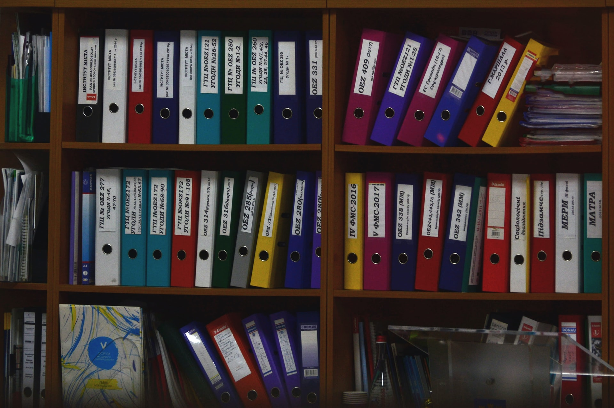
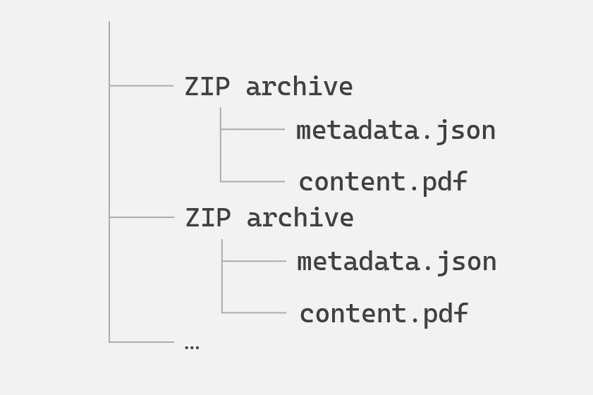
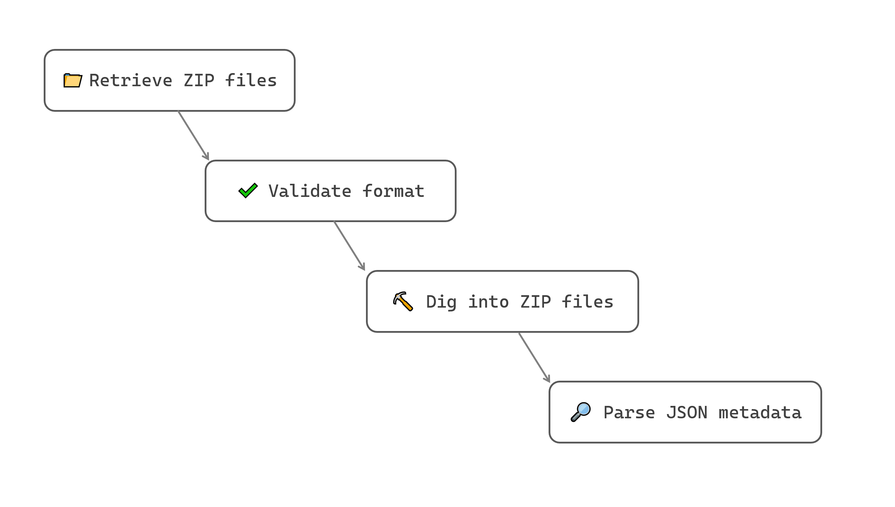

Dealing with archive files was never close to seldom in the past times, and surely won't ever be !

Let's guide you here through the common process for retrieving data, content, parsing files withing archive binaries, with our ETL tool.

## 🧐 Where do we come from ?

For the educational aspect of this topic, let us consider a folder gathering all the different archives, matching the following structure:

<!-- { width="50%" } -->

<figure markdown>
```txt
├─ ZIP archive/
│       ├─ metadata.json
│       └─ content.pdf
├─  ZIP archive/
│       ├─ metadata.json
│       └─ content.pdf
└─ ...
```
</figure>

Each ZIP archive embeds a PDF content as flat file, alongside a JSON listing the metadata which we'll have to attach to the PDF document (before any injection-or-else phase).

The metadata contained in the JSON files are simply arranged like so:

<figure markdown>
```json
{
  "agency": "Agency_name",
  "customerNumber": "658217041",
  "contractNumber": "0121443-01",
  "operationDate": "20170523000000",
  "docType": "Bill",
  "fiscalYear": "2016",
  "treatmentType": "Archiving"
}
```
</figure>

## 🤔 Where to go ?

At a glance, we are just 3 (major) steps away from having a PDF content in our punnet, with a basic dataset populated from the JSON metadata :

1. First we need to import these ZIP archives into Fast2
1. Then we need to dive into the ZIP "documents" one after the other,
1. And finally focus on the JSON content to parse and map the embedded properties.

<br/>
<br/>

Since our purpose is to dive into the ZIP files, we first need to gather them all with the _**LocalSource**_ task, providing the parent folder where all these archives are currently being stored. The only required parameter is the path of the parent folder(s).

The second step is now to open these files up, in order to provide access to both the PDF content and the JSON file, revealing at the same time the metadata we are looking for. Such exposure can be achieved by using the _**DispatchingArchive**_ task.

Once accessible, the JSON file can be parsed by the _**JSTranform**_ task. Choice is yours regarding where to store the data found in the JSON content of our ZIP archive, here they will be added to the dataset of the document.

Not a big deal, right ? Let's then tackle this challenge right away, shall we !!

<figure markdown>
{ width="70%" }
</figure>

<br/>
<br/>

## 🚀 Way to go !

Inside Fast2, the map design is now pretty straightforward, given our ideas are rather clear in terms of <strike>the mission</strike> the overall order of the operations.

The map is even quite close to the 3 steps detailed earlier. The _**DispatchingArchive**_ task just needs to be preceeded by a _**MimetypeFinder**_ task to highlight the archive format (here the ZIP extension is correct, but you could deal with archives without any extension, or mis-identified format).

That way, we end up with 4 tasks :

- _**LocalSource**_, to collect the documents from local storage,
- _**MimetypeFinder**_, to assert the archive file format,
- _**DispatchingArchive**_, to open up the ZIPs,
- _**JSTranform**_, to focus on the JSONs and parse its content.



Although the configuration of the 3 first tasks can be easily guessed, the _**JSTranform**_ may need some extra consideration: the focus on the JSON content of the ZIP content of the document of the punnet (see where we are heading, here ? 👀) plus the parsing phase all happen here.

The base script for this task (as it is presented [here](../../advanced/javascript/#map-from-json)) almost suits our need, except a minor tweaking to reach down the subcontent:

```js
// First, get the document
var doc = punnet.getDocumentList().get(0);

// get JSON sub-content of ZIP-content of the document
var zipContent = doc.getContentSet().getContent().get(0);
var jsonContent = zipContent.getSubContents().get(1); // empirical decision, PDF comes first
var bytes = manager
  .getPunnetContentFactory()
  .getContentAsByteArray(jsonContent);

var String = Java.type("java.lang.String");
var lines = new String(bytes);

// Then, parse this fragment as JSON
var jsonObject = JSON.parse(lines);

// Fetch all properties from existing fragment and create them as Document data
for (pty in jsonObject)
  doc.getDataSet().addData(pty, "String", jsonObject[pty]);
```

You might even bring it further, with content deletion or architectural changed of the punnet (e.g. bringing the PDF content as direct content in the punnet, while deleting the ZIP details as they are no longer required).

Head out now to the Run screen, start your campaign and just... enjoy !

At the latest stage of your workflow, the document dataset is filled with the properties found in the JSON and integrated as metadata.

```json hl_lines="4 8-12 21-22"
"data": {
    "absoluteParentPath": "G:/path/to/folder",
    "absolutePath": "G:/path/to/folder/ZIP_archive.zip",
    "agency": "Agency_name",
    "canExecute": true,
    "canRead": true,
    "canWrite": true,
    "contractNumber": "0121443-01",
    "customerNumber": "658217041",
    "docType": "Bill",
    "fileName": "ZIP_archive.zip",
    "fiscalYear": "2016",
    "lastModified": {
        "type": "Date",
        "value": "Tue Apr 05 11:50:08 CEST 2022"
    },
    "length": {
        "value": "82009"
    },
    "mimeType": "application/zip",
    "operationDate": "20170523000000",
    "treatmentType": "Archiving"
},
"documentId": "ZIP_archive.zip",
"folders": [...]
```

## 👏 Fast2: 1, ZIP: 0

Congrats, you've made it ! From ZIP archives as input, you now end up with a usable PDF file, ready for OCR or conversion, and its metadata.

If this use-case echoes your early needs, other tasks can be tied to this map to reach a higher level of complexity characteristic of real-world migration projects.

---
