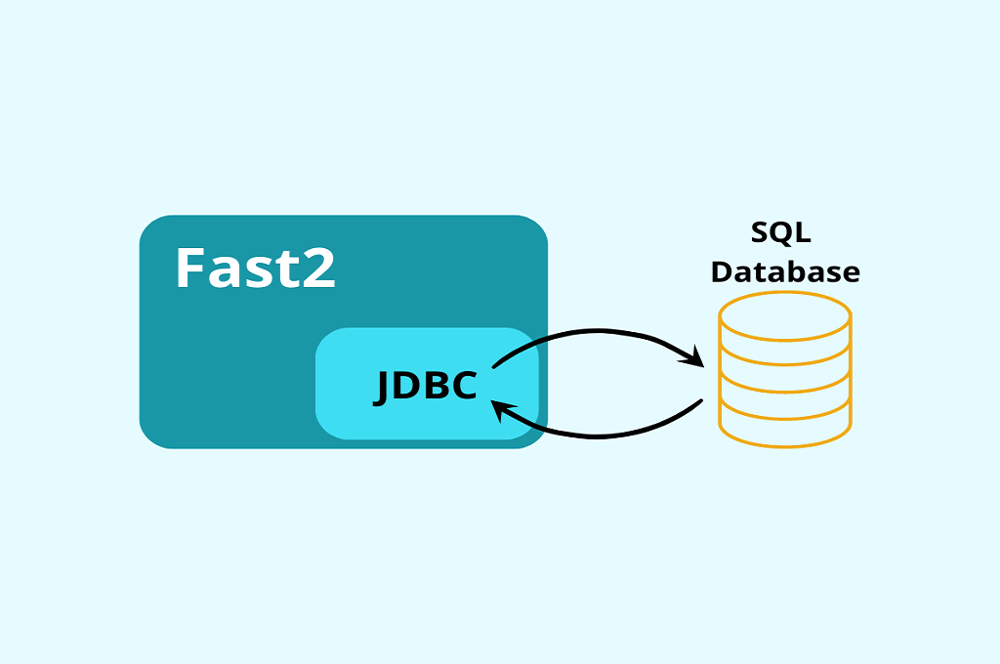
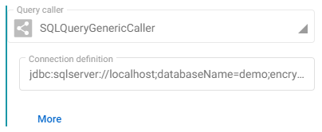
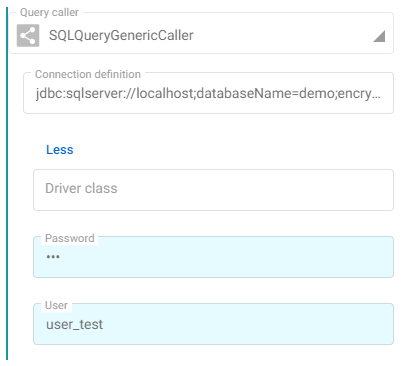
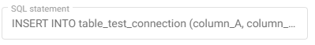
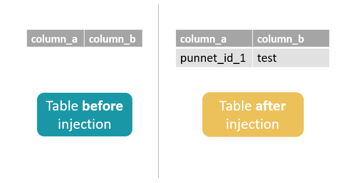

# JDBC : How to link Fast2 and SQL DB



To extract from or inject in a SQL DataBase, Fast2 use JDBC as a connector with SQL.

## Requirements

To use JDBC you must download the library related to your SQL DataBase.

### JDBC and SQLServer 2019

To begin, download the [JDBC Driver for SQLServer](https://docs.microsoft.com/en-us/sql/connect/jdbc/download-microsoft-jdbc-driver-for-sql-server?view=sql-server-ver15)

!!! warning "You must choose the right version for your JDK !"

You have two ways to check it :

1. From a command line:

    ```bash
    echo %JAVA_HOME%
    ```

2. Or, check it in your Fast2: `FAST2_HOME/config/env.properties`

After that you can add:

- The .jar file in your Fast2: `FAST2_HOME/Worker-libs/`
- The .dll in you java folders `java/java-version/jre/bin`

Use the SQL Server Configuration Manager to start the TCP port.

## Example: Injection on a SQL DataBase

For the educational aspect of this topic, let us take this map as an example

{ width="50%" }

and consider this table to inject in:

```sql
CREATE TABLE table_test_connection
(
    column_A int primary key,
    column_B varchar(100)
)
```

### How to configure the SQLStatementTask

Basically, two fields are mandory:

- The JDBC link to establish the connection between Fast2 and SQLServer. To generate it, use the [Microsoft Documentation](https://docs.microsoft.com/en-us/sql/connect/jdbc/building-the-connection-url?view=sql-server-ver15)

    { width="50%" }

    For example, you can use :

    ```
    jdbc:sqlserver://localhost;databaseName=demo;encrypt=false;integratedSecurity=true;
    ```

    If you do not want to put your credentials in the login URL, you can encrypt your password by entering your credentials by filling in the fields below.

    

- The query to insert or update your database.

    ```sql
    INSERT INTO table_test_connection (column_A, column_B) VALUES ('${punnetId}', "test");
    ```

    { width="50%" }


Now let's start your Fast2 map and check that your table has new values !

```sql
SELECT * from table_test_connection;
```

{ width="50%" }


## 👏 Fast2: 1, JDBC & SQL: 0

Congrats, you've made it !
<br><br>
Now you can also use the JDBC connection for other tasks such as [SQLMultiQueryTask](../catalog/tool.md#SQLMultiQueryTask) or [SQLSource](../catalog/source.md#SQLSource).
<br>
In addition to inserting or updating your database, you can also use these tasks to remove the contents of your tables !
