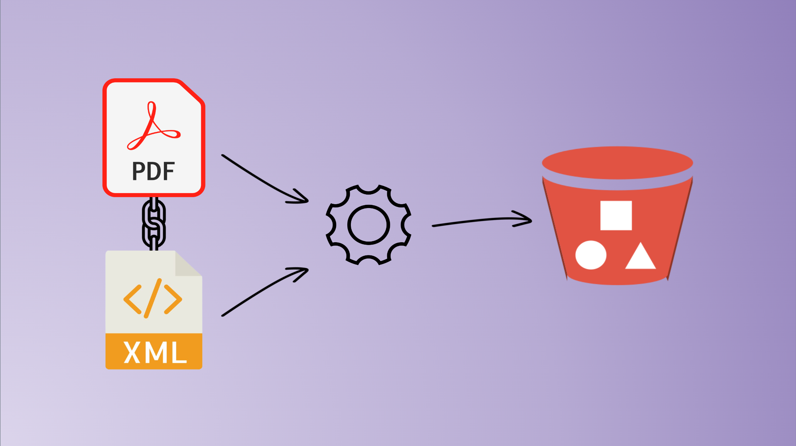
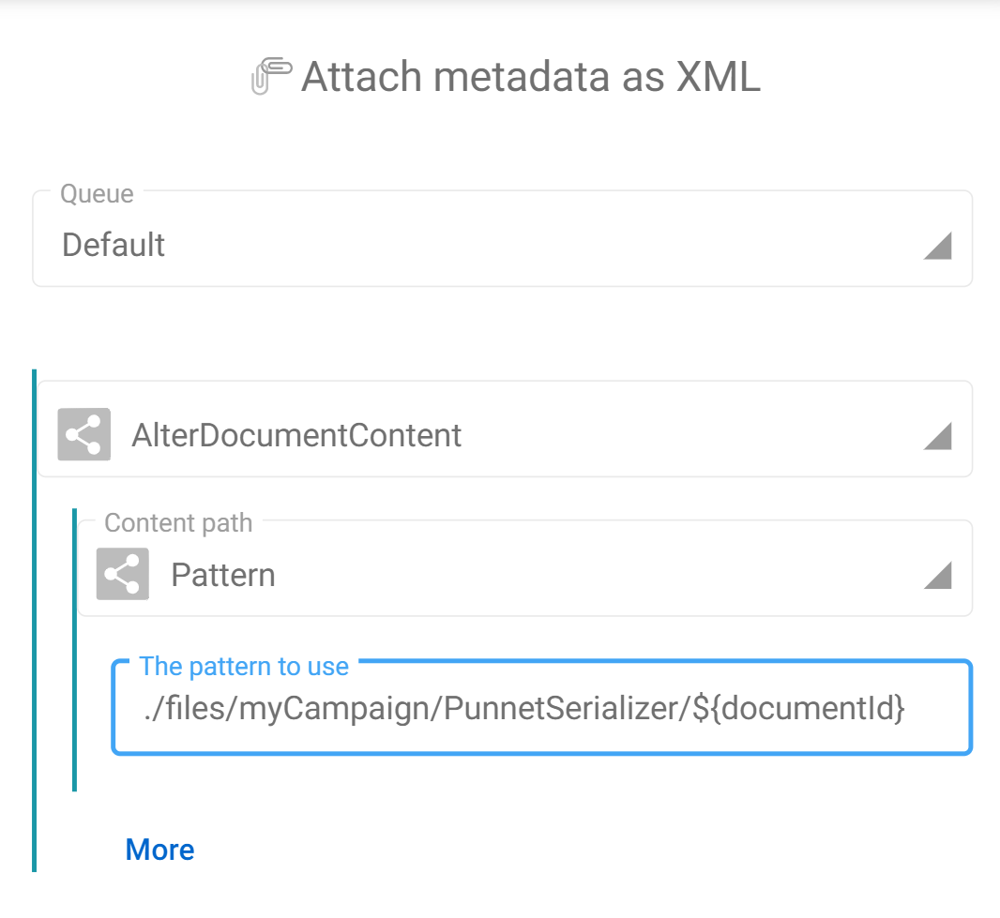
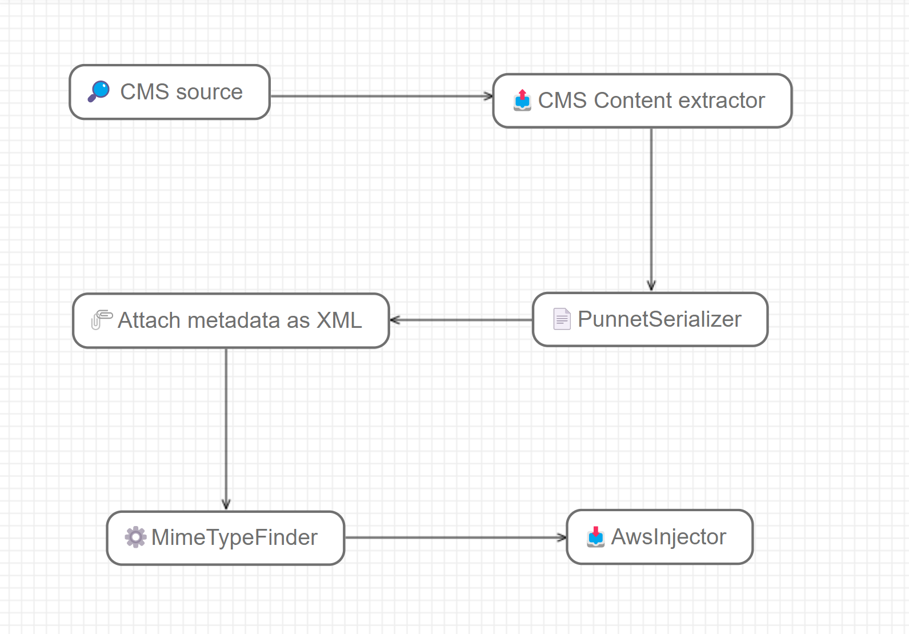
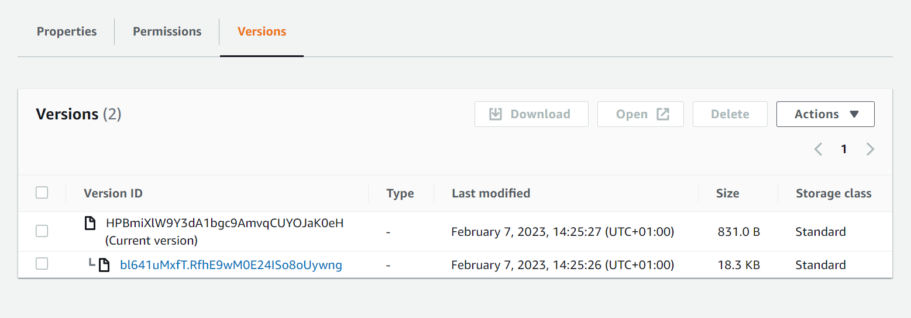
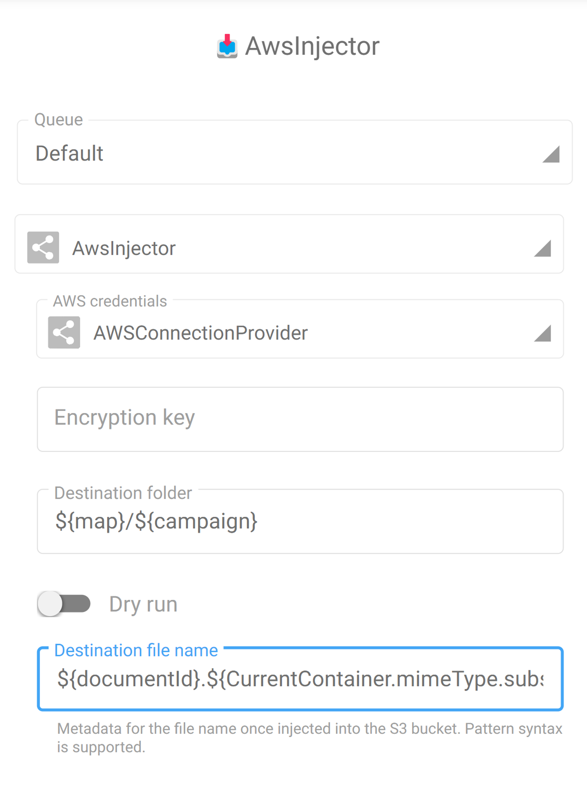
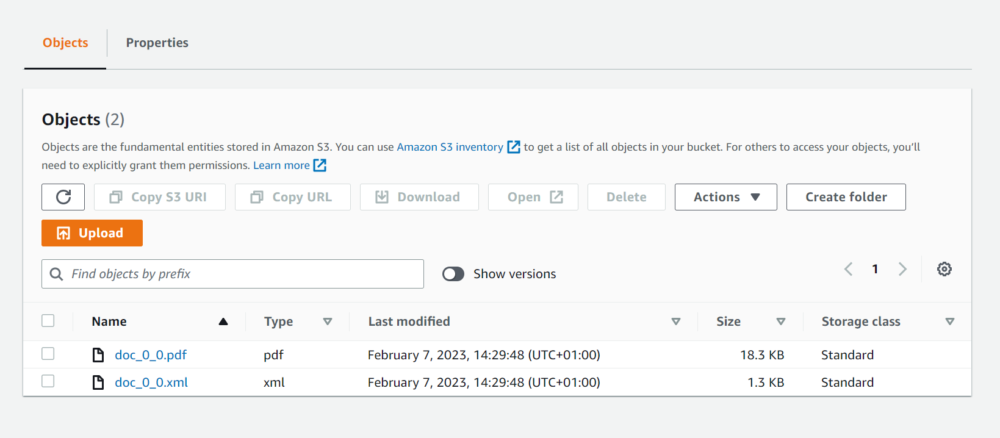
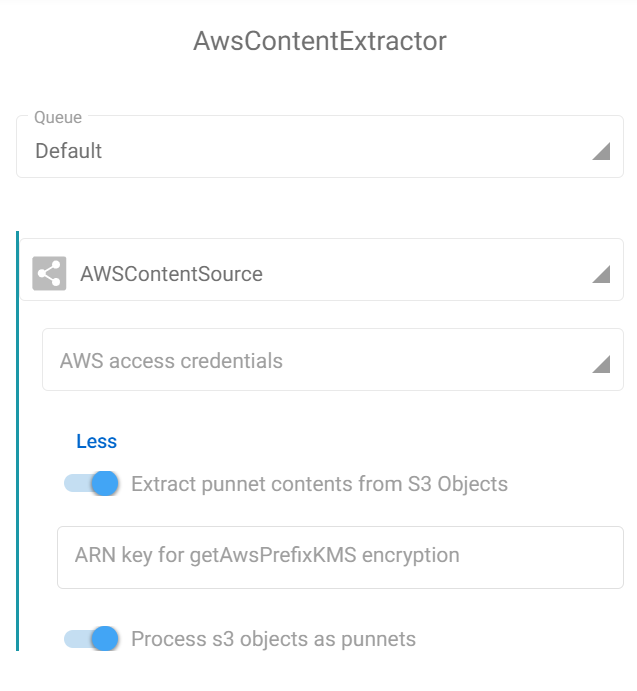

Injecting metadata into an S3 bucket needs to be done differently that what could be done with a regular content management system where a document is a set of contents and metadata. This constraint is even enforced when we upload documents into a SnowBall drive.

Let's quickly review here how storing both content and metadata in a S3 bucket can be achieved with Fast2.

## 🧐 Where do we come from ?
Let's suppose just extracted a document from a well known CMS solution, which created a regular punnet with a set of metadata and one content (ex/ a PDF file).

Injecting this document directly into a S3 bucket would just create a new binary file with the ID of the document as the name of the file in the bucket, and that would be all. Each and every metadata would have been lost in the way.

## 🤔 Where to go ?
To counteract this loss, we need to get Fast2 to add these metadata as a content too.

This can easily be done with the off-the-shelf tasks of Fast2, namely the [PunnetSerializer](../catalog/tool.md#PunnetSerializer) task and the [AlterDocumentContent](../catalog/transformer.md#AlterDocumentContent) task. Respectively, these tasks will create a new binary file with the metadata as XML inside, according to the Fast2 data model which you can find [here](../getting-started/overall-concepts.md#punnet).

In the end, we expect the bucket to have 2 contents for 1 document :

- 1 content in PDF, the original content of our document, whose name is the ID of the document with the correct extension (`.pdf`) <br/>
- 1 content in XML, filled with the metadata of the original document, whose name is the ID of the document with the correct extension (`.xml`)


## 🚀 Way to go !
Let's first create an XML file out of the metadata of the punnet, attach this created file to the document, and inject them later into our bucket.


### ⚗️ From metadata to XML
Once our document fully extracted from the source CMS (via the tasks Source and ContentExtractor), we have the content and the metadata in a punnet.

The [PunnetSerializer](../catalog/tool.md#PunnetSerializer) will convert the in-memory dataset record into XML format, in the default storage architecture (namely `$FAST2_HOME/files/<campaign>/<task>/<documentId>`). This path is the one we will have to provide in the next step of the workflow, which is the [AlterDocumentContent](../catalog/transformer.md#AlterDocumentContent) task.

In our case, the pattern for the content to add is :
```txt
./files/myCampaign/PunnetSerializer/${documentId}
```
{ width="50%" }

Eventually, the migration workflow will end up looking like this :




However, if we run it, we see the following result in the destination S3 bucket :



This can be explained by the fact that, when injecting, the S3 connector will upload both contents with the same name (which happens to be the documentId of the document). And as you might guess, 2 different documents with the same name induces the oldest one to be overwritten by the second.

We are just a tweak away of having these 2 contents alongside though, and that will need to happen in the AWSInjector connector.

## ✂️ Differentiate the 2 contents
Here, the tricky part is to identify the type of content we are dealing with.

We know that the original document is a PDF and the [PunnetSerializer](../catalog/tool.md#PunnetSerializer) generates an XML. So let's know Fast2 that information by creating the mimetype metadata on each content (as shown on the map screenshot earlier).

From now on, we can use a pattern to append the extension based on the content type value, accessing the `${CurrentContainer}` object.

The final pattern to use as "Destination file name" from the injector configuration is the following :
```java
${documentId}.${CurrentContainer.mimeType.substring(CurrentContainer.mimeType.indexOf("/")+1)}
```
In the task configuration, the field to update is the "Destination file name" :
{ width="50%" }


### 🏁 Result
This little edit will get Fast2 to build the final name on the fly for each content, and this is exactly what we needed to get the final result in our bucket :



## 👏 Let's wrap up
So now we have both contents and metadata with same name but different extension in our destination bucket, we could extract them easily with the AWSContentSource task by enabling the 2 options for such :

<li>Process S3 objects as punnets (ie. metadata as XML and associated content)</li>
<li>Extract punnet contents (if required)</li>

{ width="500" }