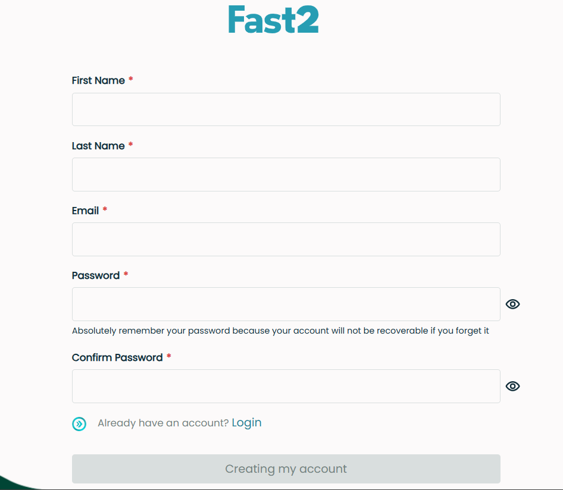
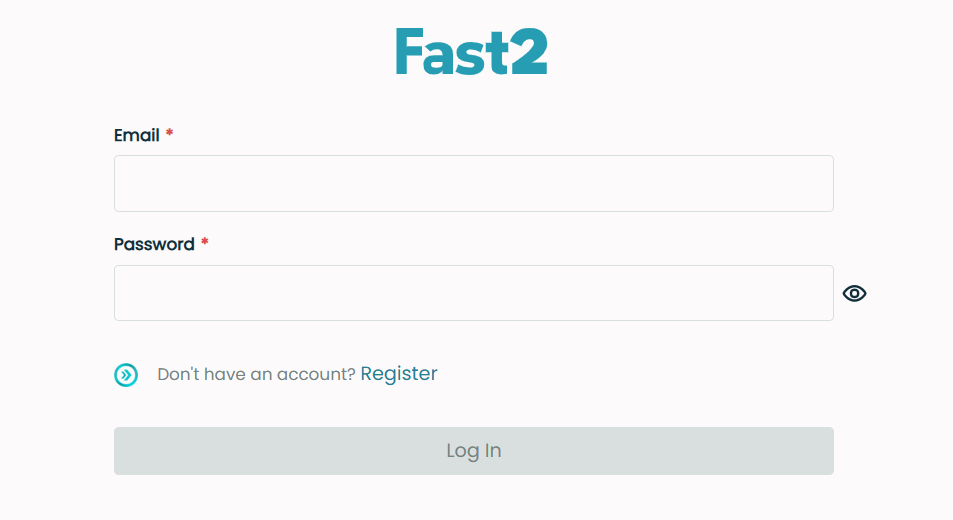

# Authentication

## Account registration
When reaching the Fast2 UI for the first time, you will be prompted to create an account.
{ width="100%" }

To create a new account in Fast2, follow these steps:

1. **Fill in the Required Information**: Enter the following details:
: **First Name**: Enter your first name.
: **Last Name**: Enter your last name.
: **Email**: Provide a valid email address. This will be used for login.
: **Password**: Choose a strong password. Remember that your password is crucial for securing your account.
: **Confirm Password**: Re-enter the same password to confirm it matches.

2. **Review the Password Guidelines**: 
: **Ensure your password meets the security requirements**: At least 8 characters long and maximum 16 characters long.

3. **Submit Your Information**: 
: Click on the "Creating my account" button to complete the registration.

!!! warning

    It is essential to remember your password. Fast2 does not offer password recovery for forgotten passwords.

## Login
Once you have registered, you can log in to the Fast2 UI using your email and password.
{ width="100%" }