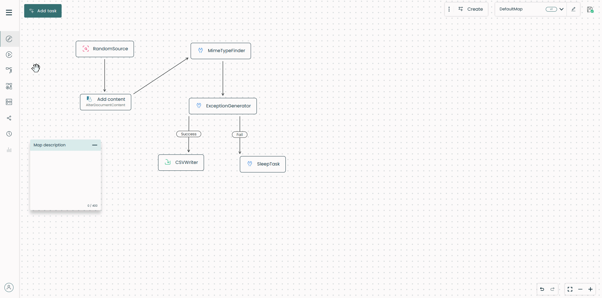
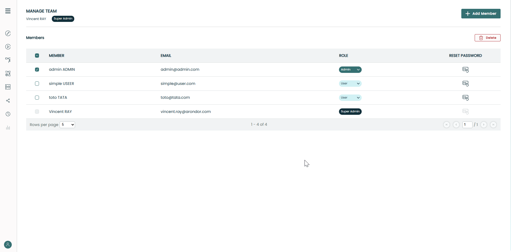
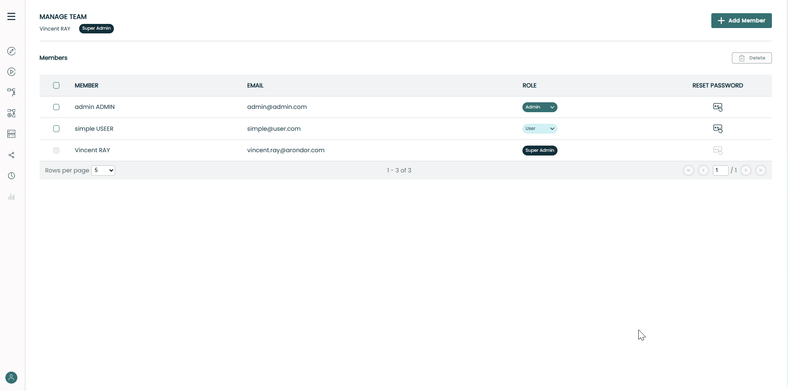
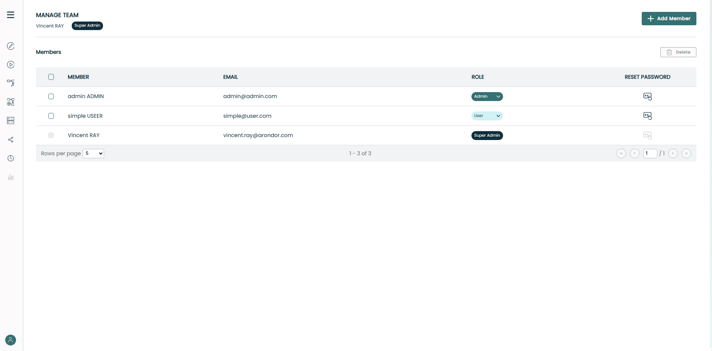

# Authentication & Team management

## Account registration
When reaching the Fast2 UI for the first time, you will be prompted to create an account.
{ width="100%" }

To create a new account in Fast2, follow these steps:

1. **Fill in the Required Information**: Enter the following details:
: **First Name**: Enter your first name.
: **Last Name**: Enter your last name.
: **Email**: Provide a valid email address. This will be used for login.
: **Password**: Choose a strong password. Remember that your password is crucial for securing your account.
: **Confirm Password**: Re-enter the same password to confirm it matches.

2. **Review the Password Guidelines**: 
: **Ensure your password meets the security requirements**: At least 8 characters long and maximum 16 characters long.

3. **Submit Your Information**: 
: Click on the "Creating my account" button to complete the registration.

!!! warning

    It is essential to remember your password. Fast2 does not offer password recovery for forgotten passwords.

## Login
Once you have registered, you can log in to the Fast2 UI using your email and password.
{ width="100%" }

## Team management
Fast2 allows you to manage multiple users. **When starting Fast2 for the first time, the created user will be the super admin.** The Team Place allows authorized users (Super Admin and Admins) to manage team members in a Fast2 Place. It includes:

- Viewing all members with details: Name, Email, Role
- Adding, deleting, and updating member roles
- Resetting member passwords

### Navigating to Team Place
To access Team Place:
1. Click on your account avatar in the bottom left corner of the screen.
2. Select **Manage Team** from the popup menu.
{ width="100%" }

#### User Access Restrictions

- **Super Admin/Admins**: Full access to Team Place.
- **Users**: If a user tries to access the Team Place, he will be redirected to EditPlace with error toast:
> `You do not have permission to access this Place`

### Adding a new member

#### Adding a new member as Super Admin
1. Click **Add Member**.
2. A modal appears with the following fields:
   - Role *(default: User, editable)*
   - First Name
   - Last Name
   - Email
   - Password
   - Confirm Password

#### Validations
- Email format validation and uniqueness check.
- Password requirements displayed when focusing on the field.
- Save button enabled only when all fields are valid.
{ width="100%" }

#### Adding a member as Admin
- Button labeled **Add User**.
- Role field preset to *User* and **read-only**.

**Only Super Admin can add new members as Admins.**

### Deleting a member

#### Deleting a member as Super Admin
1. Select one or more members (Users or Admins) via checkboxes.
2. Click **Delete**.
3. Confirmation popup appears with:
   - Member details
   - Warning: `This action cannot be undone`
   - Buttons: **Cancel**, **Delete**
{ width="100%" }

#### Deleting a member as Admin
- Can delete **Users only**.
- Checkboxes for Admins and Super Admins are disabled.

### Changing a member's role

#### Changing role as Super Admin

1. Click on the role tile (User/Admin) for a member.
2. Mini popup appears:
   - *“Promote member → Admin”* or *“Demote member → User”*
3. Confirm in the modal popup:
   - Member details
   - Warning about role change permissions
{ width="100%" }

#### Changing role as Admin
- Can only promote or demote **Users**.
- Role change for other Admins or Super Admins is **not allowed**.

### Resetting a member's password
- Available in the Members table via **Reset Password** button.
- Confirmation popup appears before action.
- Success notification confirms the password reset.
- Do not forget to send the new password to the user.
{ width="100%" }