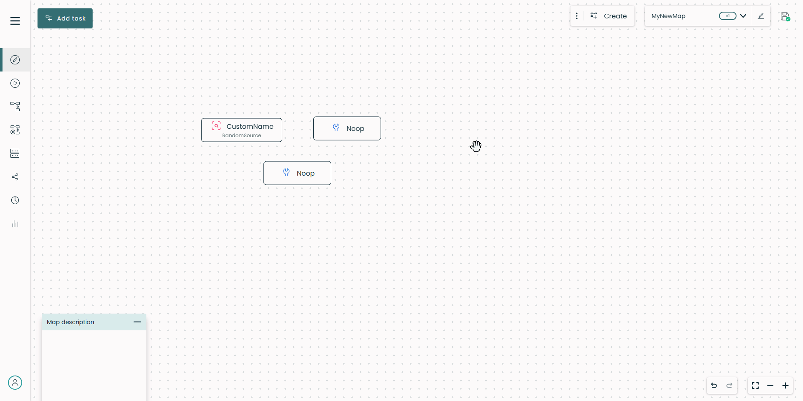
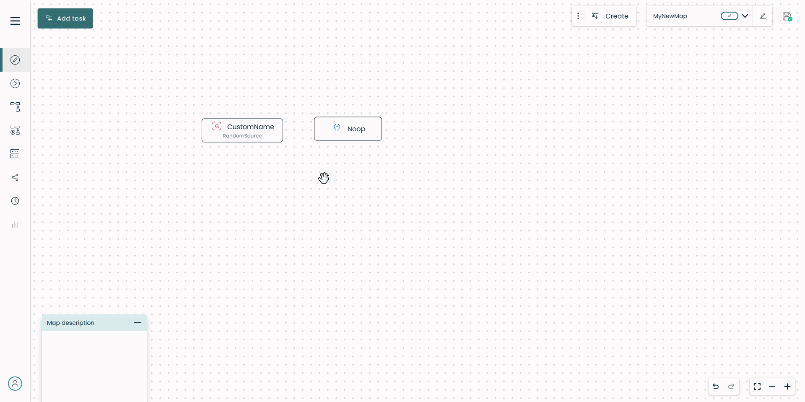
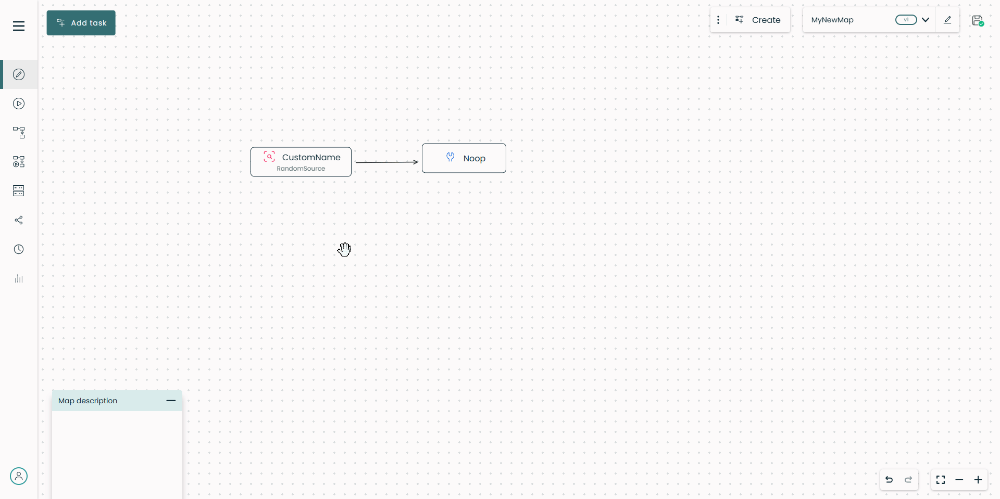
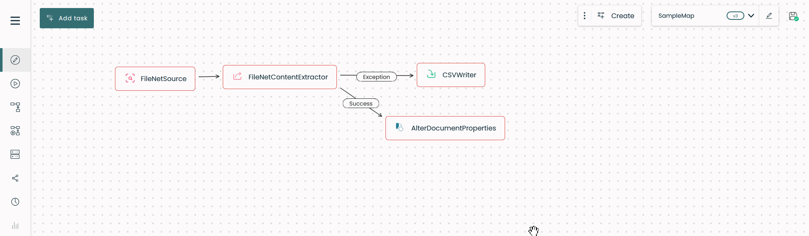
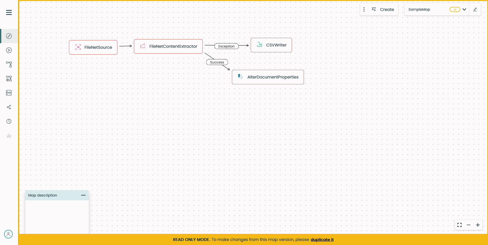
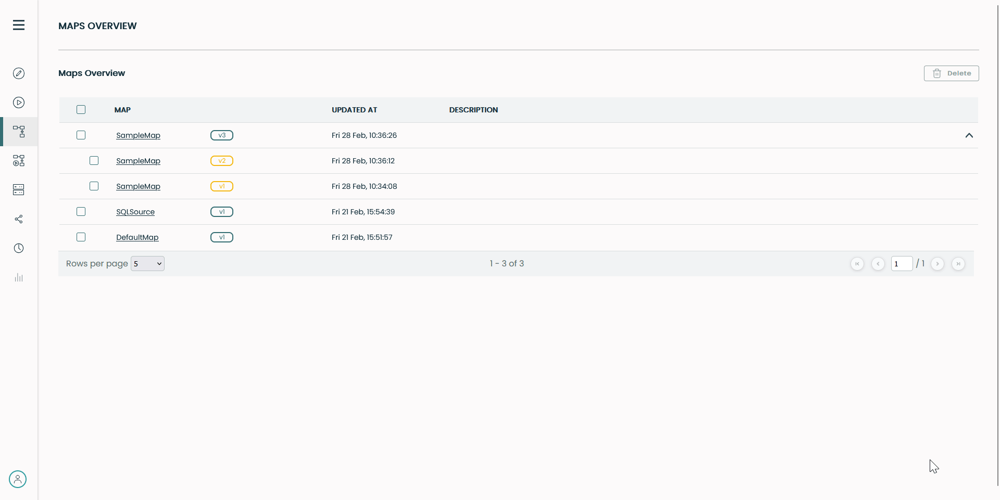

# Create a map

!!! warning

    Fast2 does not check the integrity of workflows built by the user. It is the responsibility of the latter not to build incoherent maps.

The very first step of every migration is to start building the workflow. Since Fast2 is an ETL, the sequence of all tasks needs to meet this philosophy :

1. first you extract/retrieve the content,
1. then you perform any required transformation to get the content compliant with the target system,
1. finally you load the content and/or its metadata.

With Fast2 started, go to the UI (default address <http://localhost:1789/index.html>). From here, you can create a new map browse your machine to import an existing one.

!!! warning

    A map must start with a <b><i>Source</i></b> task, picked up from the list in the [task configuration section](../catalog/source.md).

Any change about the map configuration/structure needs to happen in one place only : the design place. Changing the map name, adding or configuring either tasks or links, all these operations will take place in the Design Place.

To add any task to the map, toggle the right panel and search for the task. The dynamic search bar filters out all matching task based either on their name or description.
To select a task, click on its name and it will appear in the design area. You will be able to configure it straight afterwards, since the right panel now displays the configuration fields of the task you just added.

<!-- todo -->

For task and link configuration, please head towards the [task configuration](#tasks) and [link configuration](#links) sections.

### Set and edit map name

The map name can either be set from the pop-up when creating/duplicating a map, or changed later on.

!!! note

      1.  A map **name** cannot be empty.
      2.  Every map must have a single and unique **name**, whatever its version.

When the map is displayed, the name can be updated by directly from the top banner. Once its name edited, the map needs to be saved, otherwise the name will remain as was.

### Download a map

Any map can be downloaded directly through the Fast2 UI. Select the map you want then click on download icon located at the top banner.

You can also reach maps from the installation folder of Fast2, in the `/maps` folder.

Fast2 also stores maps into the database instance.

### Upload a map

V1 maps are compatible with the V2, but not the other way around.

Click on the browse icon at the top banner and select the map to upload. Fast2 will automatically switch to the freshly uploaded map.

If you upload multiple times the same map, Fast2 will create a new copy of the map by putting at the end the next suffix `_V-n`, where _n_ is the version number of your map.

### Delete a map

!!! info

    Maps can only be deleted from the Configuration Place

To go on the configuration place, click on the gear icon at the top right banner. Use the checkboxes to select the map(s) you want to delete then click on the bin icon.

However, a backup copy is still saved in the database in case you want to restore it later.

## Tasks

!!! info

    Tasks can only by added, configured and removed from the Design Place.

### Add task

To add any task to the map, toggle the right panel and search for the task. The dynamic search bar filter all task matching based either on their name or description.
Then select a task by clicking on its name. It now appears in the design area. You will be able to configure it straight afterwards, since the right panel now displays the configuration fields of the task you just added.

### Configure task

To configure a task, hover it in the design area. When it gets dark grey, hit the gear icon : the task is now highlighted and the right panel displays the configuration fields for you to fill.

### Delete task

The deletion of a task is a 2-step long procedure. To delete a task, hover it in the design area. When it gets dark grey, click on the trash icon. On the confirmation pop-up, make sure you perform the operation on the task you really intended to delete.

## Links

!!! info

    Links can only be added, configured and removed from the Design Place.

### Add link

To add a link between two tasks, click and hold the orange link of the originator, and drag it onto the receiver task widget.
One task can have multiple input and output links.

A link can only be added between two tasks. That implies the deletion of any link attached to a specific task once this one is deleted.

!!! Warning

    Two tasks cannot be linked both ways.

### Configure link

| Link condition         | Details                                                                                                                            |
| ---------------------- | ---------------------------------------------------------------------------------------------------------------------------------- |
| PatternCondition       | Set specific condition with java language                                                                                          |
| Otherwise              | Punnet which doesn't match other conditions will pass :warning: Consider using when a task has at least 2 multiple output links |
| AlwaysTrue             | All punnets will pass, no matter what                                                                                              |
| AlwaysFalse            | All punnets will be blocked, no matter what                                                                                        |
| PunnetInException      | All punnets in exception will pass                                                                                                 |
| ContentMimeTypeMatches | Filter depending on document mimetype                                                                                              |
| NumberOfDocuments      | Filter depending on the number of document carried by the punnet                                                                   |
| PunnetHasData          | If an expected data exists the punnet will pass (punnet level)                                                                     |
| DocumentHasData        | If an expected data exists the punnet will pass (document level)                                                                   |
| Or                     | Use multiple link conditions and if one of them is ok, the punnet will pass                                                        |
| And                    | Use multiple link conditions and if all of them are ok, the punnet will pass                                                       |
| Not                    | Use any link condition but with negatively                                                                                         |

### Delete link

Deleting a link is similar to deleting a task, 2-step long procedure. To delete a link, hover it in the design area. When it gets dark grey, click on the trash icon. On the confirmation pop-up, make sure you perform the operation on the link you really intended to delete.

## Run a map

!!! info

    A map can only be executed from the Run Place

From the toggle button you are able to switch between the Design and the Run places.

Next to this toggle button, you'll find the control buttons. It's with these three buttons that you will be able to interact with the campaign.

{ width="20%" }

From left to right :

- _Run as new_:  When a campaign is run for the first time , a pop-up will ask you to put a name. Otherwise, a new campaign is created keeping the original campaign name and incrementing the `_Try` number.
- _Rerun_:  Fast2 will run the same campaign again. No any campaign will be created.
- _Stop_:  For a running campaign, you have the opportunity to stop its process. Notice that the stop button becomes a _Resume_ button once the campaign is stopped.

!!! info

    A map must be run as new for the first time

When the map has at least been run once as new it is possible to replay a new run over it without necessarily doing as new. To do so, click on the blue play button surrounded by an arrow. Results for all replayed campaigns will be aggregated.

You can see in the table below the allowed actons depending on the campaign status.

| Campaign Status | Action(s) allowed         |
| --------------- | ------------------------- |
| Started         | Stop                      |
| Stopped         | Start as new  Resume |
| Undefined       | Start as new  Rerun  |
| Finished        | Start as new  Rerun  |

## New campaign name

You can create a new series of campaigns with a new name for a given campaign by modifying the campaign name textBox. If the new campaign name does not already exist you are automatically forwarded to the new one and ready to run it. It's mainly a creation than a modification.

You cannot change the campaign name for an already existing one. The modification is aborted and the original name is putted back.

## Example

Supposing you have a map named _Production_. You've decided to run this map and click on the `Run as new` button. Put the name of your campaign in the pop-up textBox, for example _prodCampaign_, and click on `Start`.

Fast2 will run your campaign but renaming it in _prodCampaign_Try1_. By hitting the `Run as new` again the pop-up will not show again since the map owns already few campaigns, one actually. Instead, a new campaign will be run and called _prodCampaign_Try2_ and so on.

Now, imagine that you want to rename your campaign with the name _newCampaignName_. Click on the campaign textBox, put your new name. You're gonna be redirected to a run place with your freshly created campaign. Hitting the `Run as new` and you will find you're campaign _newCampaignName_Try1_ running.

At this moment you have two series of campaigns related to your map _Production_.

## Map versioning

### Benefits of versioning

Fast2 allows you to create multiple versions of the same map. This feature provides several significant benefits:

1. **Change Management and Tracking**
: **Historical Record**: Versioning allows you to maintain a record of all changes made to a map. This is critical for understanding how workflows have evolved over time.
: **Auditability**: Regulatory or internal compliance often requires a clear audit trail. Versioned maps make it easy to demonstrate changes and decisions.

2. **Flexibility for Iteration**
: **Testing New Versions**: You can test new map configurations while maintaining the stability of the current version in production. This reduces risk and allows for experimentation.
: **Rollback Capabilities**: If a new version introduces issues, you can quickly revert to a previous version.

3. **Support for Continuous Improvement**
: **Incremental Optimization**: Maps can be improved incrementally while keeping a reliable baseline version in production.
: **Data-Driven Updates**: Analyze performance data from different versions to identify which version works best.

Seamless version creation for the user: they have nothing to do and cannot create a version themselves (there is no manual version creation). The version number is incremented automatically. Current version you are working on is always available in the top right corner.
{ width="80%" }

### Map versions history

You can access the map versions history by clicking on the `Maps Overview` button in the left navigation menu. If a map has several versions, you can expand and see all the versions by clicking on the last version. Note that current version and previous versions are highlighted differently (green and orange).
{ width="100%" }

Orange color for previous versions means that they cannot be edited. If you decide to view a previous version, it will be opened in read-only mode.
{ width="100%" }

For any reason, if you need to work and make changes to a previous version, you can duplicate it and create a new map from it.
{ width="100%" }

## Automatic Save Feature

The automatic save functionality ensures that changes made to the workflow and its configurations are saved seamlessly, enhancing reliability and reducing the risk of data loss. Below are the differents statuses of the save button:

- **Not saved**: The map has not been saved yet (Opensearch database is not reachable).
{ width="10%" }
- **Saved**: The map has been saved successfully.
{ width="10%" }
- **Saving...**: The map is currently being saved.
{ width="10%" }

### When Does Auto Save Trigger?

The auto save is triggered under the following conditions:

1. **Configuration Changes:**
: Any changes made to tasks or links configuration fields are saved as soon as the focus is lost from the edited field.
{ width="100%" }

2. **Tasks and Links:**
: Adding or deleting a task triggers an automatic save. Adding or deleting a link between tasks also triggers an automatic save.

1. **Task Movements:**
: Moving tasks within the map also triggers an automatic save.

### What Gets Saved?

The following elements are included in the automatic save process:

- The **tasks** within the map, including their **configuration settings** and **positions**.
- The **map name**.
- The **shared objects** within the map.
- The **links** between tasks.

### Specific Case: Map Shared Objects

Modifications to a shared object within the Shared Objects place also trigger an automatic save, not limited to edits made in the main Edit place.
{ width="80%" }

This ensures that all updates, regardless of where or how they are performed, are reliably captured.

