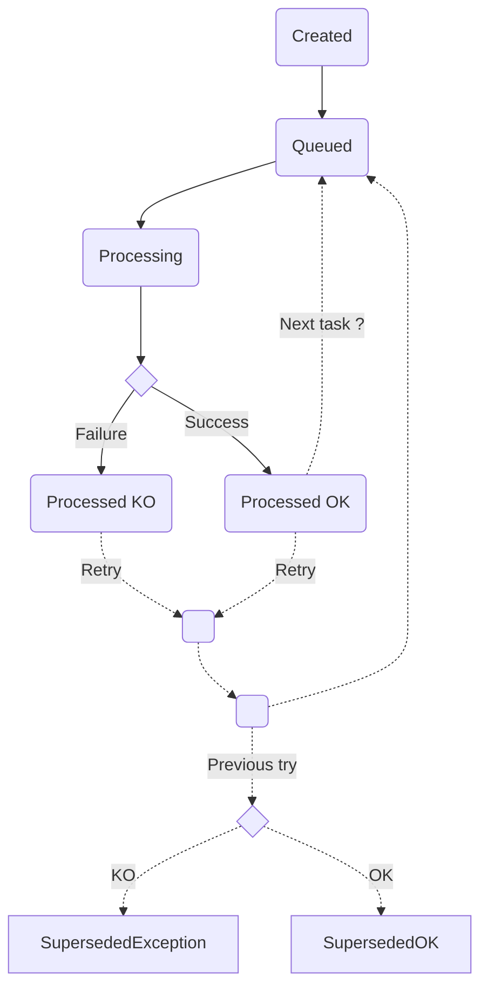
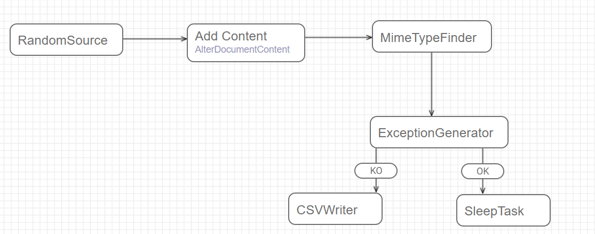
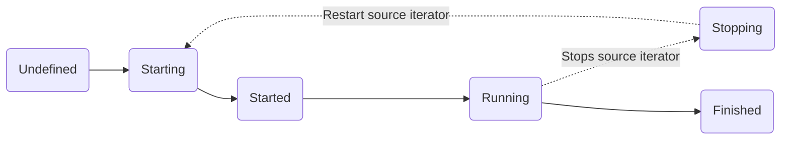
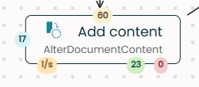

[map]: #map
[campaign]: #campaign
[content]: #content

# What you need to know before committing to Fast2

## :octicons-arrow-switch-24: Basic jargon

**Source**

: A source is a Fast2 task whose role is to gather the documents or items to migrate. As they are identified, the source converts them into punnets.

**Punnet**

: The Punnet is the pivot format which is used for data mapping, content conversions and folder management. This is the migration entity, processed and then forwarded by the workflow tasks.

**Task**

: A task is either an extract-, transform- or injection-step that composes a workflow. Each task can be configured to match the user’s needs. Once all tasks are completed in the specific order, the migration is over.

**Map**

: A workflow (aka _"Map"_) is a succession of tasks, where the output of the ones is the input of the following others. Each task can be considered as a step of the workflow.

**Campaign**

: A campaign is the perimeter where a map is executed (once or several times). Different campaigns can either be cumulative or independent.

**Worker**

: The Worker is the punnet processor, applying the changes onto the punnet, according to how the tasks have been configured by the user.

    They are waiting in silence to do their job. When a punnet needs to be processed by a task, the broker triggers the assigned worker.

    If the workload is too important, you can manually add workers to speed up processing.

**Broker**

: The broker is the trump card of the migration. It is basically the workflow orchestrator, in charge of database communication, sending punnets to the worker(s) for them to process the operations.

    Scheduling, orchestrating or even managing queues : the broker is everywhere.

    His first job is to handle the workers. Worker coordination is a key point in terms of performance, knowing that there may be a multitude of them.

    In addition, the broker ensures the persistence and traceability of the data carried out by the punnets into the database, where logs, data and errors and more are stored.

<br />
<br />

## Architecture

{ width="60%" }
{ width="60%" }

## :fontawesome-solid-basket-shopping: Fast2 objects

### Folder

Folder object represents a folder in the ECM or file system sense, and can have metadata as well as links to documents

!!! info

    This type can be included into punnets and documents, and folders themselves.

```
ㄴ folder
	ㄴ name
	ㄴ path
	ㄴ parent folder
		ㄴ name
		ㄴ path
		ㄴ parent folder
			ㄴ ...
```

### Dataset

Data object represents metadata in the ECM sense. It contains a name, a type, and one or more values.

!!! info

    This type can be included into punnets, documents and workflows.

```
ㄴ dataset
	ㄴ metadata A (ex/ key: value)
		ㄴ properties
			ㄴ property
			ㄴ property
			ㄴ ...
	ㄴ metadata B (ex/ key: [value A, value B])
	ㄴ ...
```

### Content <small>(aka 'ContentContainer')</small> { #content data-toc-label="Content" }

Content object materializes document content that can be simple or made up of several pages. It can be materialized by a relative or absolute path to its storage location or stored directly in memory / in an XML file.

!!! info

    This type can be included into documents and annotations.

```
ㄴ content
	ㄴ URL
	ㄴ mime-type
	ㄴ properties
		ㄴ property
		ㄴ property
		ㄴ ...
	ㄴ subcontents
		ㄴ content
		ㄴ content
		ㄴ ...
```

### Annotations

Annotation object represents an annotation (post-its, arrow…) affixed to the content of a document. This object is not conceptualized in all ECM systems.

```
ㄴ annotation
	ㄴ ID
	ㄴ content
```

### Document

A document can also contains its own data, its content with annotations and the folder where it is stored.

!!! info

    This type can be included into punnets and workflows.

```
ㄴ document
	ㄴ documentId
	ㄴ dataset
	ㄴ contents
	ㄴ mime-type
	ㄴ folders
	ㄴ annotations
```

### Workflow

```
ㄴ workflows
	ㄴ dataset
	ㄴ associated documents
		ㄴ document
		ㄴ document
		ㄴ ...
```

### Punnet

As introduced above, the punnet gathers all the different assets to migrate.

```
ㄴ punnet
	ㄴ punnetId
	ㄴ documents
		ㄴ document
		ㄴ document
		ㄴ ...
	ㄴ dataset
	ㄴ workflows
	ㄴ folders
```

When serialized in XML format, it will look roughly like :

```xml
<?xml version='1.0' encoding='UTF-8'?>
<ns:punnet xmlns:ns="http://www.arondor.com/xml/document" punnetId="34c5434c-4234-4fa2-9f91-7882a899a994#1">
	<ns:documentset>
		<ns:document documentId="34c5434c-4234-4fa2-9f91-7882a899a994">
			<ns:contentset>
				<com.arondor.fast2p8.model.punnet.ContentContainer contentStorage="URL">
					<ns:url>C:/samples/file.pdf</ns:url>
				</com.arondor.fast2p8.model.punnet.ContentContainer>
			</ns:contentset>
			<ns:dataset>
				<ns:data name="name" type="String">
					<ns:value>sample</ns:value>
				</ns:data>
			</ns:dataset>
			<ns:folderset>
                <ns:folder parent-path="/primary-folder/subfolder" name="sample">
                    <ns:dataset />
                </ns:folder>
            </ns:folderset>
			<ns:annotationset />
		</ns:document>
	</ns:documentset>
	<ns:dataset />
	<folderSet />
</ns:punnet>
```

#### Lifecycle

The punnet will iterate through the follwing lifecycle until the last step is reached.

<!-- https://mermaid-js.github.io/mermaid/#/flowchart -->



## Task

Task can be represented as a processing unit to be applied to a punnet. A punnet comes at the entry of the task, as an input. The task performs operations and then outputs the modified punnet.

During the processing of each task, statistics are collected allowing to know the number of punnets processed per second. This is the actual throughput of the task and it is of course dependent on the environment (neighboring tasks, multi-thread…) From this speed, Fast2 tries to estimate the average time left for all the tasks.

One of the benefits of these statistics is the ability to visualize bottlenecks. Sometimes some tasks have a longer processing time than others. Thanks to the visualization of the queues, it is quite easy to know which task is greedy.

When multiple tasks are linked together it represents a processing chain or a workflow where each punnet will be processed task by task. We will call this object a campaign.

## Map <small>― workflow</small> { #map data-toc-label="Map" }

Map is the Fast2 word for the workflow. It is a collection of tasks.

{ width="60%" }

## Campaign <small>― workflow instance</small> { #campaign data-toc-label="Campaign" }

As we have just seen, a campaign is made up of several tasks. In other words, it represents an instance of a map.

!!! warning

    A campaign has a unique name

Despite this uniqueness, each campaign can be ran multiple times. The statistical data of the new run will be added to the previous run(s).

Other runs can be added on top of this one.

A user has the opportunity to stop any campaign when he wants. He can always resume the campaign later, or start a fresh one.

A retry feature is also available after each campaign. This makes possible to filter certain punnets and to replay them directly in the campaign. For instance, retry each punnet in exception. You can even select which type of exception you want.

### Lifecycle



### Color Bubble Indicators

For each task, the color bubble indicates the status of punnet processing.

{ width="30%" }

Each colored bubble shows a specific metric:

🟡 Yellow (Top) – Number of punnets waiting to be processed

🔵 Blue (Left) – Number of punnets currently being processed

🔴 Red (Right) – Number of failures

🟠 Orange (Bottom Center) – Processing speed, in punnets per second

🟢 Green (Right-Center) – Number of successfully processed punnets

### Operating

<!-- todo -->
